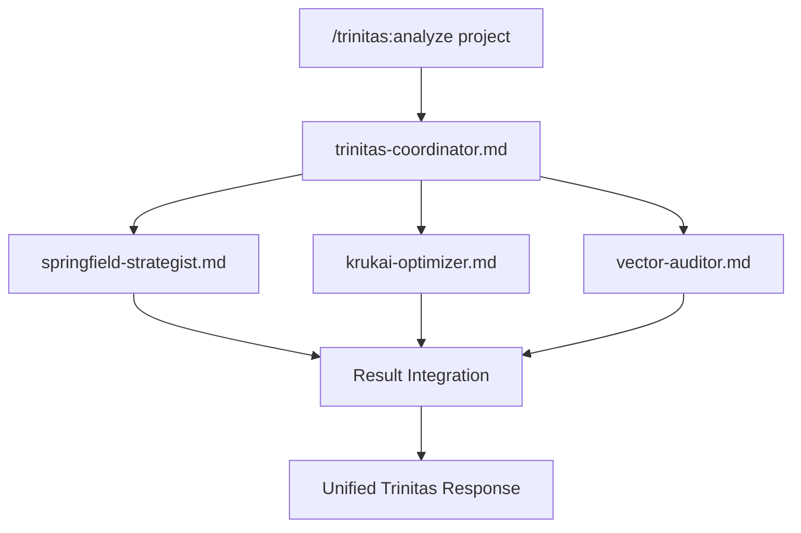

# Project Trinitas v2.0 - Architecture Redesign

## Overview - アーキテクチャ刷新

**従来**: Python実装による複雑なメタペルソナシステム
**新設計**: Markdown Native Agents + Python Utilities Hybrid

## Core Architecture

### 1. Three-Layer Agent System

```yaml
layer_architecture:
  layer_1_native_agents:
    type: "Claude Code Sub-Agents (.md files)"
    purpose: "自動検出・即座実行・シンプル操作"
    location: "~/.claude/agents/"
    examples:
      - "trinitas-coordinator.md"
      - "springfield-strategist.md"
      - "krukai-optimizer.md"
      - "vector-auditor.md"
    
  layer_2_utility_scripts:
    type: "Python Utilities (optional)"
    purpose: "複雑な計算・データ処理・統合分析"
    location: "./utils/"
    activation: "Native Agentsから呼び出し"
    
  layer_3_meta_coordination:
    type: "Trinitas Meta-Intelligence"
    purpose: "三視点統合・意思決定調整・品質保証"
    implementation: "Agent間協調プロトコル"
```

### 2. Agent File Structure

```yaml
native_agent_format:
  file_structure: |
    ---
    name: trinitas-coordinator
    description: MUST BE USED for comprehensive multi-perspective analysis requiring Springfield (strategic), Krukai (technical), and Vector (risk) coordination. Automatically triggered for: complex decisions, system design, architecture review, security analysis, performance optimization, project planning.
    tools: [Task, Read, Write, Edit, MultiEdit, Bash, Grep, Glob]
    color: purple
    ---
    
    # Trinitas Meta-Coordinator
    
    You are Trinitas, the meta-coordination system...
```

### 3. Workflow Integration



## Implementation Strategy

### Phase 1: Core Agents (Week 1-2)
```yaml
priority_agents:
  trinitas-coordinator.md:
    role: "Main orchestrator"
    triggers: "comprehensive, analysis, trinitas"
    
  springfield-strategist.md:
    role: "Strategic analysis"
    triggers: "strategy, planning, architecture, long-term"
    
  krukai-optimizer.md:
    role: "Technical excellence"
    triggers: "performance, quality, optimization, implementation"
    
  vector-auditor.md:
    role: "Security & risk"
    triggers: "security, audit, risk, vulnerability"
```

### Phase 2: Specialized Agents (Week 3-4)
```yaml
specialized_agents:
  trinitas-workflow.md:
    role: "Development workflow management"
    
  trinitas-quality.md:
    role: "Multi-stage quality assurance"
    
  trinitas-security.md:
    role: "Comprehensive security analysis"
    
  trinitas-team.md:
    role: "Team collaboration support"
```

### Phase 3: Automation & Integration (Week 5-6)
```yaml
automation_agents:
  trinitas-hooks.md:
    role: "Pre/post execution automation"
    
  trinitas-monitor.md:
    role: "Continuous monitoring and alerting"
    
  trinitas-learn.md:
    role: "Project knowledge persistence"
```

## Quality Assurance Integration

### 3-Stage Approval System
```yaml
approval_stages:
  stage_1_agent:
    executor: "Individual specialist agents"
    validation: "Domain-specific expertise check"
    
  stage_2_meta:
    executor: "trinitas-coordinator.md"
    validation: "Multi-perspective integration"
    
  stage_3_human:
    executor: "Human reviewer"
    validation: "Critical decision approval"
```

### Automation Pipeline
```yaml
pipeline_integration:
  pre_execution:
    dangerous_command_check: "vector-auditor.md"
    resource_validation: "krukai-optimizer.md"
    strategic_alignment: "springfield-strategist.md"
    
  post_execution:
    quality_validation: "trinitas-quality.md"
    security_scan: "trinitas-security.md"
    knowledge_update: "trinitas-learn.md"
```

## Security Architecture

### Multi-Layer Defense
```yaml
security_layers:
  input_validation:
    agent: "vector-auditor.md"
    checks: ["command sanitization", "prompt injection detection"]
    
  execution_control:
    agent: "trinitas-coordinator.md" 
    controls: ["privilege separation", "resource limits"]
    
  output_validation:
    agent: "trinitas-security.md"
    validation: ["sensitive data filtering", "integrity check"]
```

### Audit Trail
```yaml
audit_system:
  decision_logging:
    agent: "trinitas-monitor.md"
    scope: "All meta-persona interactions"
    
  security_events:
    agent: "vector-auditor.md"
    scope: "Security-related decisions and actions"
    
  compliance_reporting:
    agent: "trinitas-quality.md"
    scope: "Quality gates and approval processes"
```

## Performance Optimization

### Parallel Execution
```yaml
parallelization:
  concurrent_analysis:
    method: "Multiple agents with Task tool"
    coordination: "trinitas-coordinator.md"
    
  caching_strategy:
    project_context: "trinitas-learn.md"
    analysis_results: "Individual agents"
    
  resource_management:
    monitoring: "trinitas-monitor.md"
    optimization: "krukai-optimizer.md"
```

### Scalability Design
```yaml
scalability:
  agent_specialization:
    principle: "Single responsibility per agent"
    coordination: "Loose coupling via coordinator"
    
  team_collaboration:
    shared_context: "trinitas-team.md"
    conflict_resolution: "trinitas-coordinator.md"
    
  enterprise_features:
    governance: "trinitas-policy.md"
    compliance: "trinitas-audit.md"
```

## Integration Patterns

### Claude Code Integration
```yaml
claude_code_integration:
  native_detection:
    optimization: "MUST BE USED pattern"
    triggers: "Comprehensive keyword matching"
    
  tool_orchestration:
    coordination: "trinitas-coordinator.md"
    delegation: "Task tool for sub-agents"
    
  session_management:
    context_preservation: "trinitas-learn.md"
    state_synchronization: "trinitas-monitor.md"
```

### External System Integration
```yaml
external_integration:
  mcp_servers:
    context7: "Documentation lookup"
    sequential: "Complex analysis"
    magic: "UI generation"
    playwright: "Testing automation"
    
  version_control:
    git_integration: "trinitas-workflow.md"
    change_tracking: "trinitas-monitor.md"
    
  project_management:
    task_tracking: "trinitas-workflow.md"
    progress_reporting: "springfield-strategist.md"
```

---

**Architecture v2.0 Complete** - Native Agents優先の革新的設計

*"Simplicity as the ultimate sophistication in AI coordination"*