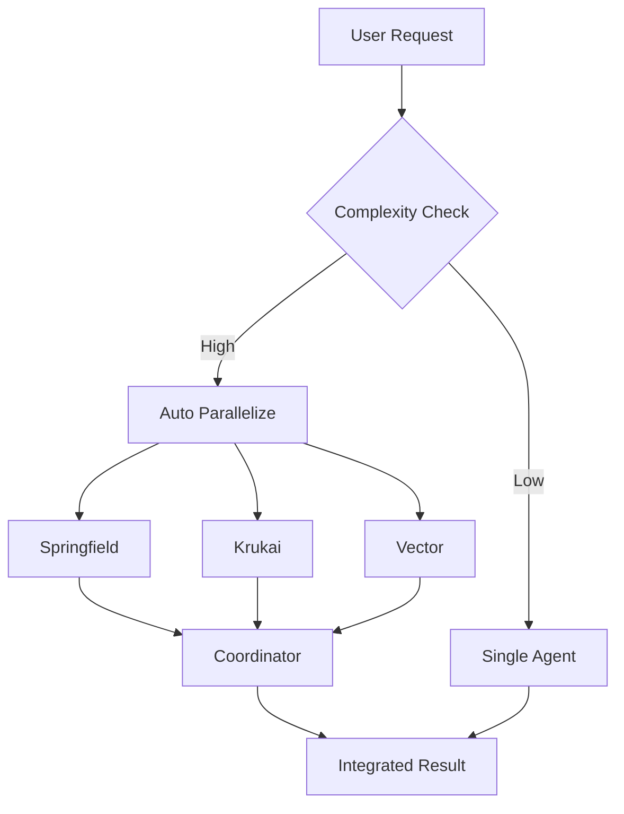

# Trinitas Parallel Execution Guide
*並列実行機能の完全ガイド*

## 🚀 Overview

Trinitasは高度な並列実行機能を提供し、複数のエージェントを同時に実行して処理時間を大幅に短縮します。

## 📊 並列実行の仕組み

### 自動並列化
Trinitasは以下の条件で自動的に並列実行を判断します：

1. **複雑度評価**: タスクの複雑度が3以上（5段階評価）
2. **エージェント適合性**: 2つ以上のエージェントが適切
3. **キーワード検出**: 複数の専門領域に関連するキーワードを検出

### インテリジェントな実装
```python
# prepare_parallel_tasks.py の動作
1. プロンプトの複雑度を自動評価
2. 適切なエージェントを自動選択
3. 各エージェント用に特化したプロンプトを生成
4. 優先度に基づいて実行順序を決定
5. 結果を自動統合
```

## 🎯 使用方法

### 方法1: 自動並列化（推奨）
通常のTaskツール使用時に自動的に並列化が判断されます：
```
複雑なタスクを依頼するだけで、自動的に並列実行されます
```

### 方法2: 明示的な並列実行
`@trinitas-parallel` エージェントを使用：
```
@trinitas-parallel このプロジェクトを包括的に分析して
```

### 方法3: 複数エージェント指定
複数のエージェントを明示的に指定：
```
@springfield-strategist と @krukai-optimizer と @vector-auditor を同時に起動して分析
```

## 🔧 設定

### settings.json
```json
{
  "hooks": {
    "PreToolUse": [
      {
        "matcher": "Task",
        "hooks": [
          {
            "type": "command",
            "command": "~/.claude/trinitas/hooks/python/prepare_parallel_tasks.py",
            "environment": {
              "TRINITAS_PARALLEL_ENABLED": "true"
            }
          }
        ]
      }
    ]
  }
}
```

### 環境変数
- `TRINITAS_PARALLEL_ENABLED`: "true"で並列実行を有効化（デフォルト: true）
- `TRINITAS_SESSION_ID`: セッションIDが自動設定される
- `TRINITAS_PARALLEL_COUNT`: 並列実行するエージェント数

## 📈 パフォーマンス

### 期待される高速化
- 2エージェント並列: 約1.4倍高速
- 3エージェント並列: 約2.1倍高速
- 4エージェント以上: 約2.5倍高速（上限）

### 最適な使用場面
- ✅ 複雑な分析タスク
- ✅ 多角的な視点が必要な設計
- ✅ セキュリティと性能の同時評価
- ✅ 包括的なコードレビュー

### 非推奨な場面
- ❌ 単純な単一タスク
- ❌ 順序依存性が強いタスク
- ❌ リソース集約的な処理

## 🎨 エージェントの役割

### Core Trinity
1. **Springfield-Strategist** (優先度: 3)
   - 戦略立案、アーキテクチャ設計
   - キーワード: plan, design, strategy, architecture

2. **Krukai-Optimizer** (優先度: 2)
   - 性能最適化、コード品質
   - キーワード: optimize, performance, refactor, efficiency

3. **Vector-Auditor** (優先度: 1)
   - セキュリティ、リスク評価
   - キーワード: security, audit, risk, vulnerability

### Support Agents
4. **Trinitas-Quality** (優先度: 4)
   - テスト、品質保証
   - キーワード: test, qa, quality, validate

5. **Trinitas-Workflow** (優先度: 5)
   - ワークフロー、自動化
   - キーワード: workflow, automate, pipeline, ci/cd

6. **Trinitas-Coordinator** (優先度: 0)
   - 結果統合（常に最後に実行）

## 🔍 デバッグ

### テストスクリプト
```bash
./examples/test_parallel_execution.sh
```

### ログ確認
```bash
# セッションIDを確認
echo $TRINITAS_SESSION_ID

# 並列実行数を確認
echo $TRINITAS_PARALLEL_COUNT
```

### トラブルシューティング

#### 並列実行されない場合
1. 環境変数を確認: `TRINITAS_PARALLEL_ENABLED=true`
2. Pythonスクリプトの権限: `chmod +x ~/.claude/trinitas/hooks/python/prepare_parallel_tasks.py`
3. settings.jsonの設定を確認

#### エラーが発生する場合
1. Pythonのバージョン確認（3.8以上推奨）
2. ファイルパスの確認
3. 依存関係の確認

## 📝 実装例

### 複雑なプロジェクト分析
```python
# 自動的に以下のように並列実行される
tasks = [
    {
        'agent': 'springfield-strategist',
        'focus': 'アーキテクチャと長期戦略'
    },
    {
        'agent': 'krukai-optimizer',
        'focus': '性能とコード品質'
    },
    {
        'agent': 'vector-auditor',
        'focus': 'セキュリティとリスク'
    },
    {
        'agent': 'trinitas-coordinator',
        'focus': '結果の統合と総合判断'
    }
]
```

## 🌟 ベストプラクティス

1. **複雑なタスクで活用**: 単純なタスクでは並列化のオーバーヘッドが発生
2. **明確な指示**: 各エージェントが理解しやすい明確な指示を提供
3. **結果の確認**: trinitas-coordinatorの統合結果を重視
4. **段階的な利用**: まず自動並列化を試し、必要に応じて明示的指定

## 🚦 実行フロー



## 📚 関連ドキュメント

- [Agent Development Guide](./ADDING_NEW_AGENTS_GUIDE.md)
- [Hooks System Documentation](../hooks/README.md)
- [Trinity Architecture](./TRINITY-ARCHITECTURE.md)

---

*Trinitas Parallel Execution System v3.0*
*Efficiency through parallel intelligence*