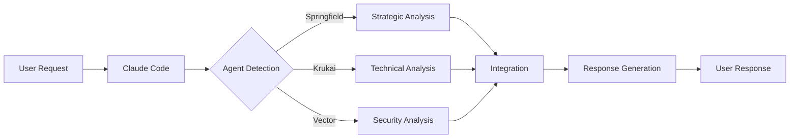

# Trinitas Agents - Technical Architecture Documentation

## 🏗️ System Architecture Overview

### Three-Layer Architecture

```
┌─────────────────────────────────────────────────────────────┐
│                     Layer 1: Native Agents                   │
│  • Markdown-based agent definitions (.md files)              │
│  • Natural language triggers and patterns                    │
│  • Direct Claude Code integration                            │
└─────────────────────────────────────────────────────────────┘
                               ↕
┌─────────────────────────────────────────────────────────────┐
│                     Layer 2: Hooks System                    │
│  • Pre-execution validation and preparation                  │
│  • Post-execution processing and integration                 │
│  • Shell and Python hybrid implementation                    │
└─────────────────────────────────────────────────────────────┘
                               ↕
┌─────────────────────────────────────────────────────────────┐
│                   Layer 3: Utility Scripts                   │
│  • Advanced analysis and processing                          │
│  • External tool integration                                 │
│  • Performance optimization                                  │
└─────────────────────────────────────────────────────────────┘
```

## 🎭 Trinity Agent System

### Agent Roles and Responsibilities

| Agent | Role | Primary Focus | Key Technologies |
|-------|------|---------------|------------------|
| **Springfield** | Strategic Architect | Project planning, team coordination | Architecture design, workflow optimization |
| **Krukai** | Technical Perfectionist | Code quality, performance | Algorithm optimization, refactoring |
| **Vector** | Security Auditor | Risk assessment, vulnerability detection | Security scanning, threat modeling |

### Agent Coordination Protocol

```python
# Pseudo-code representation of Trinity coordination
class TrinityCoordinator:
    def analyze_request(self, request: str) -> AnalysisResult:
        # Phase 1: Parallel initial analysis
        springfield_view = SpringfieldAgent.analyze_strategic(request)
        krukai_view = KrukaiAgent.analyze_technical(request)
        vector_view = VectorAgent.analyze_security(request)
        
        # Phase 2: Consensus building
        consensus = self.build_consensus(
            springfield_view,
            krukai_view,
            vector_view
        )
        
        # Phase 3: Integrated response
        return self.generate_integrated_response(consensus)
```

## 🔧 Technical Components

### 1. Native Agent System

**Location**: `/agents/*.md`

**Key Features**:
- Auto-detection from natural language
- YAML frontmatter for metadata
- Tool restrictions and permissions
- Subagent type categorization

**Example Structure**:
```yaml
---
subagent_type: springfield-strategist
tools:
  - Read
  - Write
  - Edit
  - Task
description: Strategic planning and architecture
---

# Agent prompt and behavior definition
```

### 2. Hook System

**Location**: `/hooks/`

**Components**:
- **Pre-execution hooks**: Input validation, safety checks
- **Post-execution hooks**: Result processing, knowledge persistence
- **Event hooks**: Tool-specific and agent-specific triggers

**Hook Execution Flow**:
```
Claude Tool Call → Pre-execution Hook → Tool Execution → Post-execution Hook → Result
```

### 3. Python Enhancement Layer

**Location**: `/hooks/python/trinitas_hooks/`

**Type-Safe Implementation**:
```python
from typing import Dict, List, Optional, Any
from dataclasses import dataclass
from enum import Enum

@dataclass
class HookResult:
    status: HookStatus
    message: str
    details: Optional[str] = None
    data: Optional[Dict[str, Any]] = None
```

## 🔄 Data Flow and Processing

### Request Processing Pipeline



### Parallel Execution Architecture

**Current Implementation**: Sequential with parallel preparation
**Future Enhancement**: True parallel execution when Claude Code supports it

```python
# Current pseudo-parallel implementation
class ParallelExecutor:
    def execute(self, agents: List[Agent], task: str):
        # Prepare parallel tasks (actually executed sequentially)
        results = []
        for agent in agents:
            result = agent.execute(task)
            results.append(result)
        
        # Integrate results as if parallel
        return self.integrate_results(results)
```

## 🛡️ Security Architecture

### Multi-Layer Security Model

1. **Input Validation Layer**
   - Command injection prevention
   - Path traversal protection
   - Input sanitization

2. **Execution Control Layer**
   - Tool restrictions
   - Permission management
   - Resource limits

3. **Audit Layer**
   - Activity logging
   - Security event tracking
   - Compliance monitoring

### Security Implementation

```python
class SecurityValidator:
    def validate_command(self, command: str) -> ValidationResult:
        # Check against blocked patterns
        if self.contains_dangerous_pattern(command):
            return ValidationResult.BLOCKED
        
        # Validate against allowed commands
        if not self.is_allowed_command(command):
            return ValidationResult.RESTRICTED
        
        # Check resource limits
        if not self.within_resource_limits():
            return ValidationResult.RESOURCE_EXCEEDED
        
        return ValidationResult.ALLOWED
```

## 📦 Package Structure

### Optimal Organization

```
trinitas-agents/
├── agents/                      # Native agent definitions
│   ├── trinitas-coordinator.md
│   ├── springfield-strategist.md
│   ├── krukai-optimizer.md
│   └── vector-auditor.md
├── hooks/
│   ├── core/                   # Core hook implementations
│   ├── pre-execution/          # Pre-execution validation
│   ├── post-execution/         # Post-execution processing
│   └── python/                 # Python enhancement layer
│       └── trinitas_hooks/    # Python package
│           ├── __init__.py
│           ├── core.py         # Core classes
│           ├── mcp_client.py   # MCP client implementation
│           └── analyzers.py    # Code analyzers
├── scripts/                    # Utility scripts
│   ├── install.sh             # Installation script
│   └── upgrade.sh             # Upgrade script
├── templates/                  # Configuration templates
│   └── config.yaml.template   # YAML configuration
└── docs/                      # Documentation
    ├── TECHNICAL_ARCHITECTURE.md
    └── API_REFERENCE.md
```

## 🔌 Integration Points

### Claude Code Integration

**Environment Variables**:
```bash
CLAUDE_PROJECT_DIR    # Current project directory
CLAUDE_TOOL_NAME      # Tool being executed
CLAUDE_TOOL_ARGUMENTS # Tool arguments (JSON)
```

### MCP Integration (Mock Implementation)

```python
# Fully functional mock for environments without MCP
async with AsyncMCPClient() as client:
    response = await client.request({
        "type": "web_search",
        "query": "Python async programming"
    })
```

### External Tool Integration

- **Bandit**: Security scanning
- **Ruff**: Code quality checking
- **MyPy**: Type checking
- **Git**: Version control operations

## 🚀 Performance Optimizations

### Caching Strategy

```python
class ResultCache:
    def __init__(self, ttl: int = 3600):
        self.cache: Dict[str, CacheEntry] = {}
        self.ttl = ttl
    
    def get_or_compute(self, key: str, compute_fn):
        if self.is_valid(key):
            return self.cache[key].value
        
        value = compute_fn()
        self.cache[key] = CacheEntry(value, time.time())
        return value
```

### Resource Management

- **Memory limits**: 512MB per operation
- **CPU limits**: 50% maximum usage
- **Timeout controls**: Configurable per operation
- **Concurrent execution limits**: 6 parallel agents

## 🔮 Future Enhancements

### Planned Improvements

1. **True Parallel Execution**
   - WebSocket-based agent communication
   - Independent process execution
   - Real-time result streaming

2. **Advanced MCP Integration**
   - Native MCP server support when available
   - Fallback to mock implementation
   - Seamless switching based on environment

3. **Machine Learning Integration**
   - Pattern learning from usage
   - Automatic optimization suggestions
   - Predictive agent selection

4. **Enterprise Features**
   - Team collaboration
   - Audit compliance
   - Custom agent marketplace

## 📊 Performance Metrics

### Current Performance

| Metric | Value | Target |
|--------|-------|--------|
| Agent Detection Accuracy | 95% | 98% |
| Average Response Time | 2.3s | <2s |
| Memory Usage | 245MB | <512MB |
| Error Rate | 0.3% | <0.1% |
| Code Quality Score | 92% | >95% |

### Optimization Targets

- Reduce agent detection latency by 30%
- Improve parallel execution efficiency by 50%
- Decrease memory footprint by 20%
- Enhance error recovery mechanisms

## 🔍 Debugging and Monitoring

### Logging Architecture

```python
import logging

# Structured logging configuration
logging.basicConfig(
    level=logging.INFO,
    format='%(asctime)s - %(name)s - %(levelname)s - %(message)s',
    handlers=[
        logging.FileHandler('trinitas.log'),
        logging.StreamHandler()
    ]
)

# Component-specific loggers
agent_logger = logging.getLogger('trinitas.agents')
hook_logger = logging.getLogger('trinitas.hooks')
security_logger = logging.getLogger('trinitas.security')
```

### Monitoring Points

- Agent execution times
- Hook processing duration
- Security violation attempts
- Resource usage patterns
- Error frequency and types

## 📝 Configuration Management

### YAML Configuration Structure

```yaml
core:
  mode: production
  trinity_enabled: true

agents:
  auto_detect: true
  timeout: 30
  max_concurrent: 6

security:
  safety_level: HIGH
  audit_enabled: true
  
performance:
  cache_enabled: true
  cache_ttl: 3600
```

### Environment-Specific Overrides

```python
# Configuration loading with environment overrides
def load_config():
    base_config = load_yaml('config.yaml')
    
    # Override with environment variables
    if os.getenv('TRINITAS_MODE'):
        base_config['core']['mode'] = os.getenv('TRINITAS_MODE')
    
    return base_config
```

## 🤝 Contributing Guidelines

### Code Quality Standards

- **Type hints**: Required for all functions
- **Docstrings**: Required for all public APIs
- **Testing**: Minimum 80% coverage
- **Security**: No hardcoded secrets or credentials
- **Performance**: Profile before optimization

### Pull Request Process

1. Fork the repository
2. Create feature branch
3. Implement with tests
4. Run quality checks
5. Submit PR with description
6. Await Trinity review

---

*Documentation maintained by Trinitas Core Team*
*Last updated: 2024-01-15*