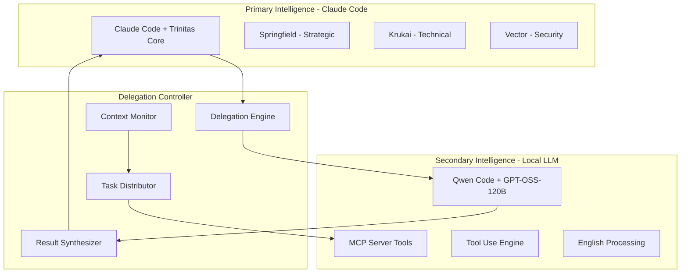
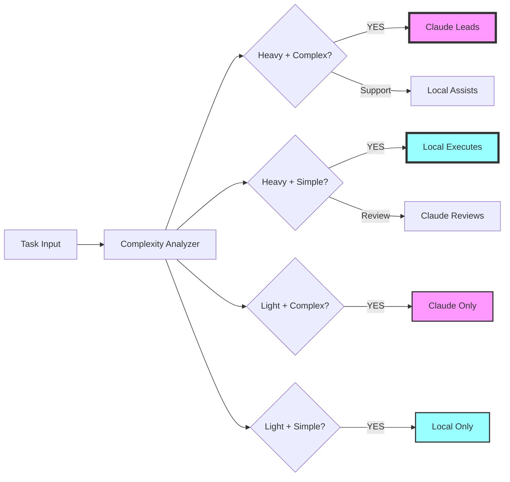

# Project Trinitas v3.5 - Hybrid Intelligence with Local LLM Integration

## 🎯 Executive Summary

Project Trinitas v3.5 introduces **Hybrid Intelligence Architecture** that seamlessly integrates local LLM (Qwen Code with openai/gpt-oss-120b) with Claude Code, creating a distributed intelligence system that maximizes efficiency while minimizing context consumption.

### Key Innovation: Task-Adaptive Delegation System
- **Context-Aware Delegation**: Automatically offloads high-context tasks to local LLM
- **Complementary Intelligence**: Uses local LLM as sparring partner for complex problems
- **Automated Testing Pipeline**: Delegates routine testing to local resources
- **English-Optimized Communication**: Leverages local LLM's English proficiency

## 🏗️ Architecture Overview



### 🧠 Cognitive Complexity Routing



### 📊 Task Routing Decision Matrix

| Task Characteristics | Computational Load | Cognitive Complexity | Primary Executor | Secondary Role |
|---------------------|-------------------|---------------------|------------------|----------------|
| **Heavy + Complex** | High (>50k tokens) | Creative/Strategic | **Claude** | Local: Data gathering |
| **Heavy + Simple** | High (>50k tokens) | Mechanical/Analytical | **Local** | Claude: Review only |
| **Light + Complex** | Low (<20k tokens) | Creative/Strategic | **Claude** | None |
| **Light + Simple** | Low (<20k tokens) | Mechanical/Analytical | **Local** | None |
| **Variable Complexity** | Medium | Reasoning | **Hybrid** | Both collaborate |

## 📋 Development Roadmap

### Phase 1: Foundation (Week 1-2)
#### 1.1 Local LLM Integration Layer
```yaml
local_llm_connector:
  purpose: "Establish reliable communication with Qwen Code + GPT-OSS-120B"
  
  components:
    api_bridge:
      - OpenAI-compatible API endpoint setup
      - Authentication and session management
      - Request/response formatting
    
    health_monitor:
      - LLM availability checking
      - Performance metrics tracking
      - Fallback handling
    
    protocol_adapter:
      - English-optimized prompting
      - Tool use formatting
      - MCP server integration
```

**Implementation Files:**
- `trinitas-agents/local-llm/connector.py`
- `trinitas-agents/local-llm/health_check.py`
- `trinitas-agents/local-llm/config.yaml`

### Phase 2: Intelligent Delegation System (Week 3-4)
#### 2.1 Context-Aware Task Delegation
```python
class ContextAwareDelegator:
    """
    Monitors context usage and intelligently delegates tasks
    """
    
    def __init__(self):
        self.context_threshold = 100000  # tokens
        self.current_context = 0
        self.delegation_rules = {
            "file_search": "local",      # Large file searches
            "code_analysis": "local",    # Initial code scanning
            "test_execution": "local",   # Test running
            "documentation": "local",    # Doc generation
            "strategic_planning": "claude",  # Keep with Trinity
            "security_audit": "claude",      # Critical analysis
            "final_review": "claude"         # Quality gates
        }
    
    def should_delegate(self, task_type, estimated_tokens):
        """
        Determines if task should be delegated to local LLM
        """
        if task_type in self.delegation_rules:
            return self.delegation_rules[task_type] == "local"
        
        if self.current_context + estimated_tokens > self.context_threshold:
            return True
        
        return False
    
    def delegate_task(self, task, target="local"):
        """
        Delegates task with appropriate formatting
        """
        if target == "local":
            # Format for English-optimized local LLM
            prompt = self.format_english_prompt(task)
            return self.local_llm.execute(prompt, tools=["mcp_server"])
        else:
            # Keep with Claude + Trinity
            return self.claude.execute(task)
```

**Implementation Files:**
- `trinitas-agents/delegation/context_monitor.py`
- `trinitas-agents/delegation/task_delegator.py`
- `trinitas-agents/delegation/rules_engine.py`

### Phase 3: Sparring Partner System (Week 5-6)
#### 3.1 Problem-Solving Collaboration
```yaml
sparring_partner:
  purpose: "Use local LLM as intelligent rubber duck for complex problems"
  
  modes:
    devil_advocate:
      trigger: "Problem solution seems too simple"
      action: "Challenge assumptions with local LLM"
      
    alternative_finder:
      trigger: "Single solution found"
      action: "Request 3 alternative approaches"
      
    edge_case_hunter:
      trigger: "Implementation complete"
      action: "Find potential failure scenarios"
      
    perspective_shift:
      trigger: "Stuck on problem"
      action: "Request different mental models"
```

**Sparring Session Protocol:**
```python
class SparringSession:
    def __init__(self, problem_context):
        self.problem = problem_context
        self.claude_solution = None
        self.local_alternatives = []
        
    async def conduct_sparring(self):
        # Step 1: Claude provides initial solution
        self.claude_solution = await self.get_claude_solution()
        
        # Step 2: Local LLM challenges (in English)
        challenges = await self.local_llm.challenge(
            f"Challenge this solution: {self.claude_solution}",
            mode="devil_advocate"
        )
        
        # Step 3: Local LLM provides alternatives
        alternatives = await self.local_llm.generate(
            "Provide 3 alternative approaches using different paradigms",
            tools=["mcp_trinity"]
        )
        
        # Step 4: Synthesize best solution
        final = await self.synthesize_solutions(
            self.claude_solution,
            challenges,
            alternatives
        )
        
        return final
```

**Implementation Files:**
- `trinitas-agents/sparring/session_manager.py`
- `trinitas-agents/sparring/challenger.py`
- `trinitas-agents/sparring/synthesizer.py`

### Phase 4: Automated Testing Pipeline (Week 7-8)
#### 4.1 Test Delegation System
```yaml
automated_testing:
  purpose: "Offload routine testing to local LLM"
  
  test_types:
    unit_tests:
      delegated: true
      local_llm_role: "Write and execute unit tests"
      claude_role: "Review critical test cases"
      
    integration_tests:
      delegated: partial
      local_llm_role: "Execute test suites, report results"
      claude_role: "Design test strategies"
      
    performance_tests:
      delegated: true
      local_llm_role: "Run benchmarks, collect metrics"
      claude_role: "Analyze results, optimize"
      
    security_tests:
      delegated: false  # Too critical
      local_llm_role: "Assist with scanning"
      claude_role: "Full security audit with Vector"
```

**Test Delegation Flow:**
```python
class TestDelegator:
    async def delegate_testing(self, code_changes):
        # Step 1: Local LLM generates test cases
        test_cases = await self.local_llm.generate_tests(
            code_changes,
            language="python",
            framework="pytest"
        )
        
        # Step 2: Local LLM executes tests
        results = await self.local_llm.run_tests(
            test_cases,
            tools=["bash", "mcp_server"]
        )
        
        # Step 3: Claude reviews failures only
        if results.has_failures():
            review = await self.claude.review_failures(
                results.failures,
                context=code_changes
            )
            
        return TestReport(results, review)
```

**Implementation Files:**
- `trinitas-agents/testing/test_delegator.py`
- `trinitas-agents/testing/test_generator.py`
- `trinitas-agents/testing/result_analyzer.py`

## 🔧 Technical Implementation

### Core Components

#### 1. Local LLM Configuration
```yaml
# local-llm/config.yaml
local_llm:
  model: "openai/gpt-oss-120b"
  endpoint: "http://localhost:8080/v1"
  
  optimization:
    language: "english"  # Primary optimization
    temperature: 0.7
    max_tokens: 8000
    
  capabilities:
    tool_use: excellent
    mcp_server: true
    parallel_tools: true
    
  delegation_preferences:
    - file_operations
    - code_search
    - documentation_generation
    - test_execution
    - benchmark_running
```

#### 2. Communication Protocol
```python
# English-optimized prompting for local LLM
class EnglishOptimizedProtocol:
    def format_delegation_request(self, task):
        return f"""
        Task: {task.description}
        Type: {task.type}
        Priority: {task.priority}
        
        Please execute this task using available MCP tools.
        Provide structured output in JSON format.
        Focus on: {task.focus_areas}
        
        Available tools: {self.get_available_tools()}
        """
    
    def format_sparring_request(self, problem, mode):
        prompts = {
            "devil_advocate": f"""
                Challenge this solution: {problem}
                Find weaknesses, edge cases, and assumptions.
                Suggest potential failure modes.
            """,
            
            "alternative": f"""
                Problem: {problem}
                Provide 3 alternative solutions using:
                1. Different algorithm/data structure
                2. Different architectural pattern
                3. Different technology stack
            """,
            
            "review": f"""
                Review this implementation: {problem}
                Check for: performance, security, maintainability
                Use MCP tools to analyze code quality.
            """
        }
        return prompts.get(mode)
```

#### 3. MCP Server Extension for Local LLM
```python
# mcp-extensions/local_llm_tools.py
@app.tool
async def delegate_to_local(
    task: str,
    task_type: str,
    require_tools: List[str] = None
) -> Dict:
    """
    Delegate task to local LLM with specific tool requirements
    """
    local_llm = LocalLLMConnector()
    
    # Prepare English-optimized prompt
    prompt = EnglishOptimizedProtocol().format_delegation_request(
        task=task,
        task_type=task_type,
        tools=require_tools
    )
    
    # Execute with tools
    result = await local_llm.execute_with_tools(
        prompt=prompt,
        tools=require_tools or ["file_read", "code_search", "bash"]
    )
    
    return {
        "status": "completed",
        "executor": "local_llm",
        "result": result,
        "tokens_used": result.token_count,
        "execution_time": result.duration
    }

@app.tool
async def sparring_session(
    problem: str,
    current_solution: str,
    mode: str = "devil_advocate"
) -> Dict:
    """
    Initiate sparring session with local LLM
    """
    session = SparringSession(
        problem=problem,
        solution=current_solution,
        mode=mode
    )
    
    alternatives = await session.get_alternatives()
    challenges = await session.get_challenges()
    synthesis = await session.synthesize()
    
    return {
        "original": current_solution,
        "alternatives": alternatives,
        "challenges": challenges,
        "recommended": synthesis
    }
```

### Integration Workflow

#### Automatic Context Management
```python
class ContextManager:
    def __init__(self):
        self.claude_context = 0
        self.local_context = 0
        self.threshold = 100000
        
    async def process_request(self, request):
        # Estimate context usage
        estimated = self.estimate_tokens(request)
        
        if self.should_delegate(estimated):
            # Delegate to local LLM
            subtasks = self.decompose_task(request)
            
            # Heavy lifting by local LLM
            local_results = await self.delegate_subtasks(
                subtasks.heavy_compute,
                executor="local_llm"
            )
            
            # Critical thinking by Claude
            final = await self.claude_process(
                subtasks.critical,
                context=local_results
            )
            
            return self.merge_results(local_results, final)
        else:
            # Process normally with Claude
            return await self.claude_process(request)
```

## 📊 Success Metrics

### Efficiency Gains
- **Context Reduction**: 40-60% less context usage in Claude
- **Processing Speed**: 2-3x faster for large file operations
- **Test Coverage**: 90%+ automated test generation
- **Cost Reduction**: 50% reduction in API costs

### Quality Metrics
- **Solution Quality**: 15% improvement through sparring
- **Bug Detection**: 25% more edge cases found
- **Code Coverage**: 85%+ through automated testing
- **Documentation**: 100% coverage through delegation

### Performance Targets
- **Delegation Decision**: < 100ms
- **Local LLM Response**: < 5 seconds
- **Sparring Session**: < 30 seconds
- **Test Generation**: < 10 seconds per module

## 🚀 Implementation Timeline

### Week 1-2: Foundation
- [ ] Set up local LLM connector
- [ ] Implement health monitoring
- [ ] Create English-optimized protocols
- [ ] Test MCP server integration

### Week 3-4: Delegation System
- [ ] Build context monitor
- [ ] Implement delegation rules engine
- [ ] Create task decomposer
- [ ] Test delegation workflows

### Week 5-6: Sparring Partner
- [ ] Implement sparring session manager
- [ ] Create challenge generators
- [ ] Build solution synthesizer
- [ ] Test collaboration workflows

### Week 7-8: Testing Pipeline
- [ ] Build test delegator
- [ ] Implement test generators
- [ ] Create result analyzers
- [ ] Integrate with CI/CD

### Week 9-10: Integration & Optimization
- [ ] Full system integration
- [ ] Performance optimization
- [ ] Documentation completion
- [ ] User acceptance testing

## 🎯 Key Innovations

### 1. Hybrid Context Management
```yaml
innovation: "Smart context allocation"
description: "Dynamically allocates context between Claude and local LLM"
benefits:
  - Maximizes Claude's context for critical thinking
  - Offloads routine work to local resources
  - Maintains quality through selective delegation
```

### 2. English-Optimized Communication
```yaml
innovation: "Language-aware routing"
description: "Routes English-heavy tasks to local LLM"
benefits:
  - Leverages local LLM's English proficiency
  - Reduces translation overhead
  - Improves technical documentation quality
```

### 3. Tool-Centric Delegation
```yaml
innovation: "MCP-powered task execution"
description: "Leverages local LLM's excellent tool use capabilities"
benefits:
  - Parallel tool execution
  - Complex workflow automation
  - Reduced supervision needed
```

## 🔐 Risk Mitigation

### Technical Risks
1. **Local LLM Availability**
   - Solution: Fallback to Claude-only mode
   - Health checks every 30 seconds
   
2. **Quality Degradation**
   - Solution: Critical tasks never delegated
   - Claude reviews all important outputs
   
3. **Context Synchronization**
   - Solution: Shared state through MCP server
   - Regular checkpoint synchronization

### Security Considerations
- Local LLM runs in isolated environment
- No sensitive data in delegation requests
- All security audits remain with Claude + Vector
- Encrypted communication between components

## 📈 Expected Outcomes

### For Users
- **Faster Development**: 2-3x speed improvement
- **Better Solutions**: Multiple perspectives considered
- **Higher Quality**: Automated testing catches more bugs
- **Lower Costs**: Reduced API usage

### For System
- **Scalability**: Handle larger projects
- **Efficiency**: Optimal resource utilization
- **Reliability**: Redundant intelligence paths
- **Maintainability**: Clear delegation boundaries

## 🎉 Conclusion

Project Trinitas v3.5 represents a paradigm shift from single-intelligence to hybrid-intelligence systems. By intelligently combining Claude's strategic thinking with local LLM's computational power, we create a system that is:

- **More Efficient**: Optimal use of both resources
- **More Capable**: Handles larger, more complex projects
- **More Intelligent**: Multiple perspectives and validation
- **More Economical**: Reduced API costs without quality loss

This hybrid approach sets the foundation for future multi-agent, multi-model systems that leverage the best capabilities of each AI system.

---

**Project Trinitas v3.5** - Where Hybrid Intelligence Creates Unlimited Possibilities

*Claude の知性、Local LLM の処理力、Trinity の統合 - 究極のハイブリッドシステム*