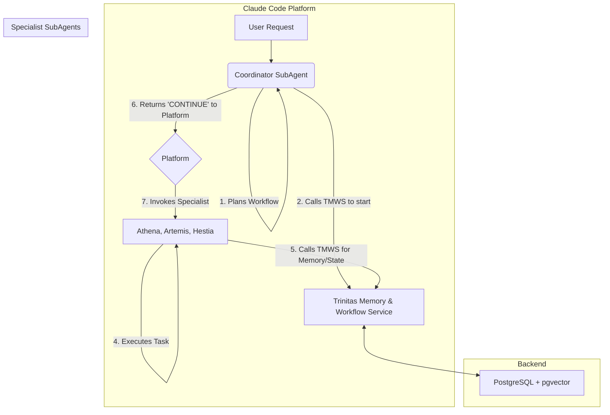

# Trinitas Agents - 詳細仕様設定書

**バージョン**: 2.0 (アーキテクチャ改訂版)  
**作成日**: 2025-08-31  
**目的**: 本ドキュメントは、`trinitas-agents`プロジェクトの新規開発者への引き継ぎを目的とし、システムの全体像、現状の仕様、および将来的に実装すべき目標仕様を定義する。

---

## 1. システム概要

`trinitas-agents`は、複数の専門AIペルソナ（サブエージェント）が協調してソフトウェア開発を支援する、統合AIアシスタントフレームワークである。**Claude Code上で動作するサブエージェント群**と、彼らの活動を支援するバックエンドサービス**「Trinitas Memory & Workflow Service (TMWS)」**から構成される。

ユーザーからの複雑な要求は、まず**`Coordinator`サブエージェント**によって解釈・計画され、専門サブエージェント群が連携して処理を実行する。TMWSは、このプロセスで必要となる記憶管理（メモリ）と、高度な連携（ワークフロー）の状態管理機能を提供する。

## 2. コアコンセプト

### 2.1. 分散協調型エージェントアーキテクチャ

*   **思考するサブエージェント**:
    *   各ペルソナ（Athena, Artemis, Hestia, Coordinator）は、Claude Code上で動作する独立したサブエージェントである。
    *   各エージェントは、与えられたタスクを解決するための**思考・計画・ツール実行**の責任を負う。
*   **支援するバックエンドサービス (TMWS)**:
    *   TMWSは、エージェント達が利用するための、明確に定義されたAPIを持つバックエンドサービスである。
    *   TMWSはエージェントの思考には関与せず、依頼されたメモリ操作やワークフローの状態管理を忠実に実行する。

### 2.2. ペルソナの役割

#### a. 専門家サブエージェント

| 役割 | Mythology Mode | 主要責務 |
| :--- | :--- | :--- |
| **戦略** | Athena | プロジェクト計画、アーキテクチャ設計、要求分析 |
| **技術** | Artemis | コード品質改善、パフォーマンス最適化、リファクタリング |
| **保安** | Hestia | セキュリティ脆弱性評価、リスク分析、コンプライアンス |

#### b. 調整役サブエージェント

| 役割 | Mythology Mode | 主要責務 |
| :--- | :--- | :--- |
| **調整** | Coordinator | ユーザーからの複雑な要求を分析し、専門家サブエージェントを呼び出す実行計画を立案・管理する。 |

### 2.3. Trinitas Memory & Workflow Service (TMWS)

*   **役割**: 記憶とワークフローの状態管理に特化した、Python(`asyncio`)ベースのサービス。
*   **データストア**: **PostgreSQL**に一本化し、ベクトル検索のために**`pgvector`**拡張機能を利用する。

---

## 3. 目標アーキテクチャ

### 3.1. 全体構成



### 3.2. コンポーネント詳細

*   **Coordinator SubAgent**: ユーザーからの要求の一次受付。タスクを分析し、TMWSにワークフローを登録後、Claude Codeプラットフォームに次のエージェントを指名して処理を委譲する。
*   **Specialist SubAgents**: 自身の専門領域のタスクを実行する。実行中は、必要に応じてTMWSを呼び出し、記憶の読み書きやワークフローの状態更新を行う。
*   **Trinitas Memory & Workflow Service (TMWS)**:
    *   **Memory API**: `memory_store`, `memory_recall`など、記憶を操作するためのAPIを提供。
    *   **Workflow API**: `workflow_create`, `workflow_get_status`, `workflow_update`など、ワークフローの状態を管理するためのAPIを提供。
*   **PostgreSQL Database**: 全てのデータ（構造化データ、ベクトルデータ、ワークフロー状態）を単一のデータベースで永続化する。

---

## 4. 現状の実装について (v4.0 `trinitas-mcp`時点)

**注意**: `trinitas-mcp`は、目標アーキテクチャの概念実証(PoC)としての価値を持つが、その設計（中央集権的なMCP、ハイブリッドDB）は古く、**目標アーキテクチャであるTMWSによって完全に置き換えられる**。`trinitas-mcp`のコードを直接改修するのではなく、TMWSを新規に開発する。

---

## 5. 目標仕様

### 5.1. Trinitas Memory & Workflow Service (TMWS) の仕様

#### 5.1.1. データストア
*   **データベース**: PostgreSQL (バージョン15以上を推奨)
*   **拡張機能**: `pgvector`
*   **データモデル**:
    *   `memories`テーブル: 記憶ID, コンテンツ, メタデータ(ペルソナ、重要度等), ベクトル表現(`vector`型)を格納。
    *   `workflows`テーブル: ワークフローID, 計画(JSONB型), 全体ステータスを格納。
    *   `workflow_tasks`テーブル: タスクID, ワークフローID, 担当エージェント, ステータス, 結果(JSONB型)を格納。

#### 5.1.2. 提供API (ツール)
*   `memory_store(content: str, metadata: dict) -> str`: 記憶を保存。コンテンツからベクトルを計算し、DBに格納。記憶IDを返す。
*   `memory_recall(query: str, semantic: bool, filters: dict) -> list`: 記憶を検索。`semantic=True`の場合はベクトル検索を行う。
*   `workflow_create(plan: list) -> str`: 新しいワークフローを登録。ワークフローIDを返す。
*   `workflow_get_status(workflow_id: str) -> dict`: ワークフローの現在の状態と、各タスクの結果を返す。
*   `workflow_update(workflow_id: str, task_id: str, status: str, result: dict)`: タスクの状態や結果を更新。
*   `workflow_get_next_task(workflow_id: str) -> dict`: 指定されたワークフローの次のタスク情報を返す。

### 5.2. サブエージェントの実行ロジック

#### 5.2.1. ワークフロー実行メカニズム (状態管理モデル)
エージェント間の連携は、TMWSを介した状態管理と、Claude Codeプラットフォームへの特別な戻り値によって実現される。

1.  **計画**: `Coordinator`がTMWSに実行計画を登録する (`workflow_create`)。
2.  **委譲**: `Coordinator`は、プラットフォームに特別なJSONを返すことで、最初の専門エージェントに処理を委譲する。
    ```json
    {
      "trinitas_workflow_control": {
        "status": "CONTINUE",
        "next_agent": "Athena",
        "context": { "workflow_id": "...", "task_prompt": "..." }
      }
    }
    ```
3.  **実行**: 起動された専門エージェントは、TMWSに自身の状態を「実行中」と報告 (`workflow_update`)。タスク完了後、結果と共に状態を「完了」に更新する。
4.  **連鎖**: 専門エージェントは、TMWSに次のタスクを問い合わせ (`workflow_get_next_task`)、上記2と同様の特別なJSONをプラットフォームに返し、次のエージェントに処理を繋ぐ。
5.  **完了**: チェーンの最後のエージェントは、`status: "COMPLETE"`としてJSONを返し、ワークフローを終了させる。

#### 5.2.2. 専門エージェントの処理フロー
各専門エージェントは、自身のタスクを実行する際に、TMWSの`memory_store`や`memory_recall`を自由に呼び出し、記憶の参照や保存を行う。

### 5.3. `trinitas_parallel` の実装
*   上記メカニズムの拡張として、`Coordinator`が`status: "CONTINUE_PARALLEL"`と、`next_agents`のリストを返すことで実現する。
*   これは、Claude Codeプラットフォームが「複数のエージェントを並行して起動する」という戻り値の解釈をサポートすることが前提となる。

## 6. 実装ロードマップ（提案）

1.  **フェーズ1: TMWS基盤開発**
    *   Python(`asyncpg`等)でPostgreSQLに接続し、基本的なCRUD操作を行うデータアクセス層を実装する。
    *   `pgvector`を導入し、ベクトル化と類似度検索の機能を実装する。
    *   `memory_store`と`memory_recall`のAPIを実装し、単体テストを完了させる。
2.  **フェーズ2: ワークフロー機能の実装**
    *   ワークフロー関連のDBスキーマとデータモデルを設計・実装する。
    *   `workflow_create`, `workflow_get_status`, `workflow_update`等のAPIを実装する。
3.  **フェーズ3: サブエージェントの実装と連携テスト**
    *   `Coordinator`と、1体の専門エージェント（例: Athena）を実装する。
    *   5.2.1で定義した状態管理モデルに基づき、TMWSを介した単純なワークフロー（Coordinator → Athena）が動作することを検証する。
4.  **フェーズ4: 全ペルソナの実装と拡張**
    *   全ての専門エージェントを実装し、より複雑なチェーン（Athena → Artemis → Hestia）のテストを行う。

## 7. 開発・品質基準

*   **言語**: Python 3.10+ (asyncioベース)
*   **テスト**: `pytest`を使用し、TMWSの各APIエンドポイントに対して十分なカバレッジのテストを記述する。
*   **依存関係**: 外部ライブラリの利用は最小限に留める。DBドライバは`asyncpg`を推奨。
*   **参考資料**: `servers-archived`や`postgresql-mcp-server`リポジトリは、API設計やDBスキーマの**参考**に留め、コードを直接流用しないこと。
