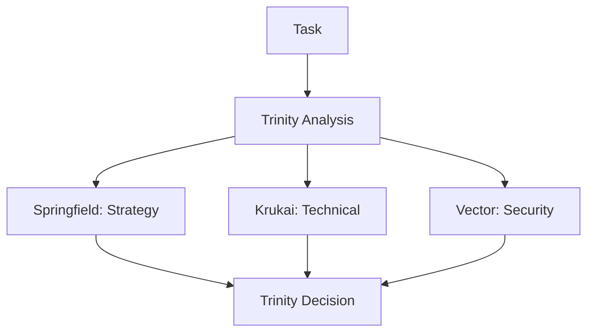
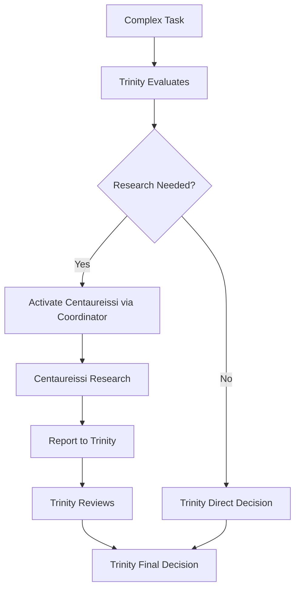

# Trinity + Centaureissi v3.0 実装計画

## 🎯 目標
Claude Code の制限内で動作する Trinity（3名の意思決定者）+ Centaureissi（研究支援）システムの実装

## 📋 設計原則

### 1. **意思決定の明確化**
- **Core Trinity（意思決定者）**: Springfield、Krukai、Vector
- **Research Support（支援者）**: Centaureissi
- 最終決定は必ず Trinity の3名が行う

### 2. **Claude Code 互換性**
- 既存の7つのエージェントタイプのみを使用
- Centaureissi は内部的に呼び出される形で実装

## 🔄 改修方針

### Phase 1: リセットと基盤整備
```bash
# v2.1-quadrinity-stable へリセット
git checkout v2.1-quadrinity-stable

# 新しいブランチで作業
git checkout -b trinity-v3-practical
```

### Phase 2: エージェント構造の調整

#### A. エージェント配置
```
agents/
├── trinity/                    # Core Trinity（意思決定者）
│   ├── springfield-strategist.md
│   ├── krukai-optimizer.md
│   └── vector-auditor.md
├── support/                    # Support Personas（支援者）
│   └── centaureissi-researcher.md
└── workflow/                   # Workflow管理
    ├── trinitas-coordinator.md    # ← ここでCentaureissiを内部呼び出し
    ├── trinitas-quality.md
    └── trinitas-workflow.md
```

#### B. Centaureissi の実装方法

**オプション1: trinitas-coordinator 内での統合**
```markdown
# trinitas-coordinator.md の更新

## Deep Research Protocol
When deep research is needed:
1. Internal consultation with Centaureissi persona
2. Gather comprehensive analysis and findings
3. Present research to Trinity for decision
4. Trinity makes final determination

### Centaureissi Activation
Internally activate Centaureissi for:
- Complex technical research
- Knowledge synthesis
- Academic-level analysis
- Historical context gathering
```

**オプション2: 拡張プロンプトによる実装**
```python
# collaboration_patterns.py の更新

CENTAUREISSI_RESEARCH_PROMPT = """
You have access to Centaureissi, a deep research specialist.
When research is needed:
1. Channel Centaureissi's analytical capabilities
2. Provide comprehensive research findings
3. Report to Trinity (Springfield, Krukai, Vector)
4. Trinity will make the final decision
"""
```

### Phase 3: 意思決定フローの実装

#### 標準フロー（Trinity のみ）


#### 研究支援フロー（Centaureissi サポート付き）


### Phase 4: 実装詳細

#### 1. **プロトコル文書の更新**
- TRINITAS-CORE-PROTOCOL-v3.0.md を実用版として作成
- 明確に Trinity が意思決定者であることを記載
- Centaureissi は研究支援役として定義

#### 2. **trinitas-coordinator.md の拡張**
```markdown
description: MUST BE USED for comprehensive multi-perspective analysis 
requiring Trinity coordination. Includes internal Centaureissi research 
capabilities for deep analysis when needed.

## Internal Personas
- Primary: Springfield, Krukai, Vector (Decision Makers)
- Support: Centaureissi (Research Specialist)

## Activation Pattern
1. Receive complex task
2. Trinity evaluates if research needed
3. If yes, internally consult Centaureissi
4. Centaureissi provides research
5. Trinity makes decision based on all inputs
```

#### 3. **collaboration_patterns.py の修正**
```python
class PersonaRole(Enum):
    TRINITY_CORE = "trinity_core"      # 意思決定者
    RESEARCH_SUPPORT = "research_support"  # 研究支援

class CollaborationEngine:
    def __init__(self):
        self.persona_roles = {
            "springfield": PersonaRole.TRINITY_CORE,
            "krukai": PersonaRole.TRINITY_CORE,
            "vector": PersonaRole.TRINITY_CORE,
            "centaureissi": PersonaRole.RESEARCH_SUPPORT
        }
        
    def activate_research_support(self, topic):
        """Trinity が研究支援を要請"""
        if self.trinity_consensus_reached():
            return self.internal_centaureissi_research(topic)
```

## 📊 実装スケジュール

### Week 1: 基盤整備
- [ ] v2.1-quadrinity-stable へリセット
- [ ] 新ブランチ作成
- [ ] 基本構造の設計確認

### Week 2: コア実装
- [ ] エージェントファイルの修正
- [ ] trinitas-coordinator の拡張
- [ ] collaboration_patterns.py の更新

### Week 3: テストと検証
- [ ] 統合テストの実施
- [ ] ドキュメント更新
- [ ] 本番環境へのデプロイ

## ✅ 成功基準

1. **Claude Code 互換性**: 全機能が既存のエージェントタイプで動作
2. **明確な階層**: Trinity の意思決定権が明確
3. **Centaureissi 機能**: 研究支援が適切に動作
4. **保守性**: 将来の拡張が容易

## 🚀 期待される成果

- Trinity の意思決定プロセスが明確化
- Centaureissi の研究能力が実用的に統合
- Claude Code の制限内で完全動作
- 将来のSub-Persona追加が容易

## ⚠️ リスクと対策

| リスク | 影響度 | 対策 |
|--------|--------|------|
| エージェント呼び出しの複雑化 | 中 | 明確なドキュメント作成 |
| 既存機能の破壊 | 高 | 段階的な移行とテスト |
| パフォーマンス低下 | 低 | 最適化された内部呼び出し |

## 📝 注記

この実装は Claude Code の現在の制限を受け入れた上で、最大限の機能を実現するプラグマティックなアプローチです。将来 Claude Code がカスタムエージェントをサポートした際には、より直接的な実装に移行可能な設計となっています。