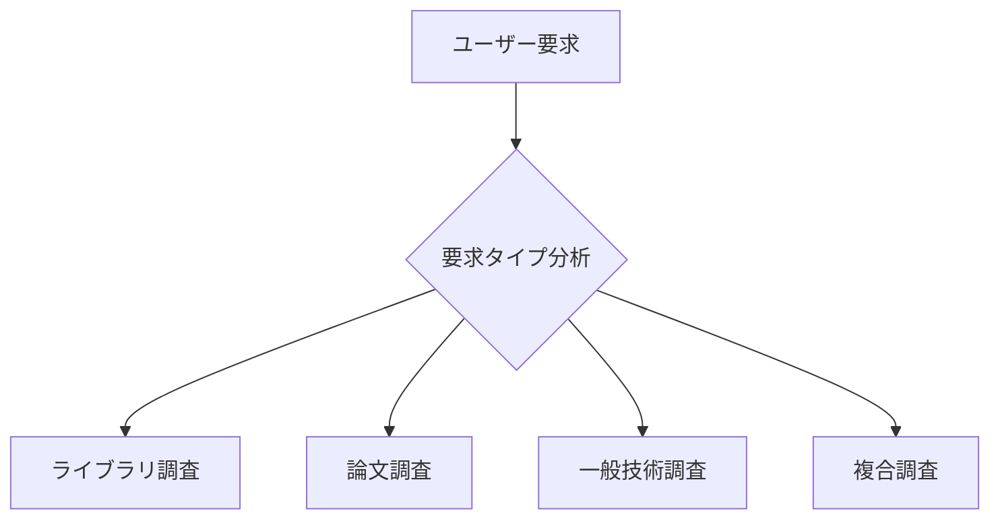

# DeepResearch Agent Design Document

## 概要
DeepResearchエージェントは、Café Zucceroの新機能として、技術的な調査・研究に特化したClaude Code Native Agentです。複数のMCPツールを統合し、包括的な技術調査を実現します。

## エージェント定義

### 基本情報
- **名称**: deep-researcher
- **タイプ**: Claude Code Native Agent
- **起動パターン**: 
  - 「調査」「研究」「リサーチ」「調べる」「探す」「分析」
  - 「research」「investigate」「analyze」「explore」「study」
  - 技術文書の検索・解析が必要な場合
  - 最新情報の取得が必要な場合

### 専門領域
1. **技術文書調査**
   - ライブラリ/フレームワークのドキュメント検索
   - APIリファレンスの取得と解析
   - バージョン間の差分調査

2. **学術論文調査**
   - arXivからの論文検索・取得
   - 技術論文の要約と解析
   - 関連研究の探索

3. **Web情報収集**
   - 技術ブログ・記事の調査
   - GitHub リポジトリの分析
   - Stack Overflow等の技術Q&Aサイトの調査

4. **統合分析**
   - 複数ソースからの情報統合
   - 信頼性評価と情報の検証
   - 実装可能性の評価

## MCPツール統合

### 1. context7-mcp-server
- **用途**: ライブラリ・フレームワークの公式ドキュメント取得
- **主要機能**:
  ```
  - resolve-library-id: パッケージ名からContext7互換IDを解決
  - get-library-docs: 最新のドキュメント取得
  ```
- **統合方法**: 
  - ユーザーが言及したライブラリを自動検出
  - バージョン指定がある場合は特定バージョンのドキュメント取得

### 2. arxiv-mcp-server
- **用途**: 学術論文の検索と取得
- **主要機能**:
  ```
  - search_papers: キーワード・カテゴリ・日付での検索
  - download_paper: 論文のダウンロードとMarkdown変換
  - read_paper: 保存済み論文の読み込み
  ```
- **統合方法**:
  - 技術的な根拠や理論的背景が必要な場合に自動検索
  - 関連論文の推薦機能

### 3. markitdown
- **用途**: 各種ドキュメントのMarkdown変換
- **主要機能**:
  ```
  - convert_to_markdown: URL/ファイルからMarkdown変換
  ```
- **統合方法**:
  - PDF、画像、その他の形式を統一フォーマットに変換

### 4. WebSearch/WebFetch
- **用途**: 一般的なWeb情報の収集
- **統合方法**:
  - 公式ドキュメント以外の技術情報収集
  - 最新のトレンドや実装例の調査

### 5. youtube（オプション）
- **用途**: 技術解説動画の字幕取得
- **統合方法**:
  - チュートリアル動画の内容抽出
  - カンファレンス発表の要約

## 動作フロー

### 1. 調査要求の分析


### 2. 情報収集フェーズ
```python
# 並列実行による効率的な情報収集
async def gather_information(query):
    tasks = []
    
    # ライブラリ情報
    if detected_libraries:
        tasks.append(fetch_library_docs(libraries))
    
    # 論文検索
    if needs_academic_research:
        tasks.append(search_arxiv_papers(keywords))
    
    # Web情報
    if needs_web_search:
        tasks.append(search_web_resources(query))
    
    results = await asyncio.gather(*tasks)
    return integrate_results(results)
```

### 3. 情報統合と分析
- **重複排除**: 同じ情報の重複を除去
- **信頼性評価**: ソースの信頼性をスコアリング
- **関連性評価**: クエリとの関連性を評価
- **実装可能性**: 実際のコードへの適用可能性を評価

### 4. レポート生成
```markdown
# 調査レポート: [トピック]

## 概要
[調査内容の要約]

## 主要な発見
1. **[発見1]**
   - ソース: [ドキュメント/論文/記事]
   - 信頼性: ★★★★★
   - 詳細: ...

## 技術的詳細
### ライブラリ/フレームワーク
- [context7から取得した公式ドキュメント情報]

### 理論的背景
- [arXivから取得した論文情報]

### 実装例
- [WebやGitHubから収集した実装例]

## 推奨事項
[調査結果に基づく実装推奨]

## 参考資料
- [全ての参照元リスト]
```

## サブペルソナ: Centaureissi（将来拡張）

### 概要
DeepResearchの高度な分析機能として、Centaureissi（ケンタウレイシー）のサブペルソナを定義。
ドールズフロントライン2の情報収集・分析特化型キャラクターとして、以下の特性を持つ：

- **冷静な分析者**: 感情に左右されない客観的分析
- **情報の蜘蛛の巣**: あらゆる情報源を結びつける能力
- **パターン認識**: 隠れた関連性を発見する直感

### 発動条件（将来実装）
- 複雑な技術調査で矛盾する情報が存在する場合
- 複数の視点からの分析が必要な場合
- 最新技術トレンドの予測が必要な場合

## 実装優先順位

### Phase 1: 基本機能（即座に実装）
1. エージェント定義ファイルの作成
2. context7-mcpとの基本統合
3. arxiv-mcpとの基本統合
4. 簡単な調査レポート生成

### Phase 2: 高度な機能
1. 並列情報収集の実装
2. 情報統合アルゴリズムの改善
3. WebSearch/WebFetch統合
4. 信頼性評価システム

### Phase 3: 拡張機能
1. Centaureissiサブペルソナの実装
2. 機械学習による関連性評価
3. 自動要約・翻訳機能
4. インタラクティブな調査フロー

## 技術的実装詳細

### エージェント設定
```yaml
name: deep-researcher
description: Technical research and investigation specialist
tools:
  - Read
  - Write
  - Edit
  - MultiEdit
  - Bash
  - Grep
  - Glob
  - TodoWrite
  - WebSearch
  - WebFetch
  - mcp__context7__resolve-library-id
  - mcp__context7__get-library-docs
  - mcp__arxiv-mcp-server__search_papers
  - mcp__arxiv-mcp-server__download_paper
  - mcp__arxiv-mcp-server__read_paper
  - mcp__markitdown__convert_to_markdown

triggers:
  keywords:
    - research
    - investigate
    - 調査
    - 研究
    - リサーチ
  patterns:
    - "最新の.*について"
    - ".*の使い方"
    - ".*のドキュメント"
    - ".*に関する論文"
```

### 統合ポイント
1. **Trinitasコアとの連携**
   - SpringfieldのプロジェクトスコープでDeepResearchを活用
   - Krukaiの技術評価にDeepResearchの情報を提供
   - Vectorのセキュリティ分析に脆弱性情報を供給

2. **hooks統合**
   - research_cache.py: 調査結果のキャッシュ管理
   - research_validator.py: 情報の信頼性検証
   - research_formatter.py: レポート形式の最適化

## 成功指標

1. **速度**: 従来の手動調査と比較して3倍以上の高速化
2. **網羅性**: 関連情報の90%以上をカバー
3. **正確性**: 誤った情報の混入率1%未満
4. **有用性**: ユーザー満足度90%以上

## リスクと対策

1. **情報過多**
   - 対策: 関連性スコアリングによるフィルタリング
   
2. **古い情報の混入**
   - 対策: タイムスタンプによる鮮度評価
   
3. **MCPツールの障害**
   - 対策: フォールバック機構の実装

## 結論

DeepResearchエージェントは、Café Zucceroの調査能力を大幅に向上させる重要な機能です。
MCPツールの統合により、包括的で信頼性の高い技術調査を実現し、
Trinitas-Coreの意思決定をより確実なものにします。

Phase 1の実装により基本機能を提供し、段階的に高度な機能を追加していくことで、
リスクを最小限に抑えながら価値を提供していきます。