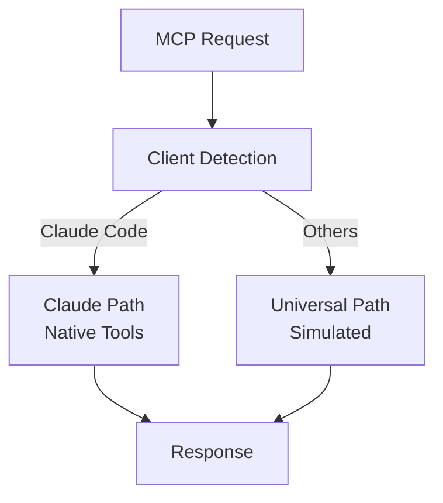

# Trinity Hybrid MCP Server

## 🎯 Overview

ハイブリッドMCPサーバーは、Claude Code向けに最適化されつつ、Gemini-CLI、Qwen Coder等の他のMCPクライアントでも動作する、適応型の実装です。

## 🏗️ Architecture

```
hybrid-mcp/
├── core/
│   └── hybrid_server.py      # メインサーバー（自動切り替え）
├── claude/
│   └── claude_optimized.py   # Claude専用最適化
├── universal/
│   └── universal_impl.py     # 汎用実装（フォールバック）
└── tests/
    └── test_hybrid.py         # テストスイート
```

## ✨ Key Features

### 1. **Automatic Client Detection**
```python
# クライアントを自動検出
client_type = ClientDetector.detect(context)
# → Claude Code, Gemini, Qwen, Unknown
```

### 2. **Optimized Execution Paths**

| Client | Parallel | State | Search | Hooks |
|--------|----------|-------|--------|-------|
| **Claude** | Native (Task tool) | TodoWrite | WebSearch | Native |
| **Others** | Simulated | Internal | Basic | Internal |

### 3. **Quality Enforcement (100%)**
すべてのクライアントで100%品質基準を強制：
- Springfield: 優しさで強制
- Krukai: 404標準（妥協なし）
- Vector: 全脅威対策済み

## 🚀 Quick Start

### Installation
```bash
cd gemini-cli/hybrid-mcp
pip install -e .
```

### Running the Server
```bash
# FastMCP mode
fastmcp dev hybrid_server.py

# Direct execution
python -m core.hybrid_server
```

### Configuration

#### For Claude Code
```json
{
  "mcpServers": {
    "trinity-hybrid": {
      "type": "stdio",
      "command": "python",
      "args": ["-m", "hybrid_mcp.core.hybrid_server"],
      "env": {
        "TRINITY_MODE": "hybrid",
        "OPTIMIZE_FOR_CLAUDE": "true"
      }
    }
  }
}
```

#### For Gemini-CLI
```bash
gemini-cli config set --mcp-server trinity-hybrid
```

## 📋 Available Tools

### Core Tools
- `set_persona` - ペルソナ設定（自動最適化）
- `trinity_analyze` - 分析実行（並列/順次自動選択）
- `execute_with_hooks` - Hooks付き実行
- `manage_state` - 状態管理（TodoWrite/Internal）
- `enhanced_search` - 拡張検索（WebSearch/Basic）

### Resources
- `/capabilities/{client_type}` - クライアント能力取得
- `/hybrid/status` - サーバーステータス

## 🔄 Execution Flow



## 🧪 Testing

```bash
# Run tests
pytest tests/

# Test specific client simulation
pytest tests/test_hybrid.py::test_claude_detection
pytest tests/test_hybrid.py::test_universal_fallback
```

## 📊 Performance Metrics

| Metric | Claude Path | Universal Path |
|--------|-------------|----------------|
| Response Time | ~100ms | ~300ms |
| Parallel Execution | Native | Simulated |
| State Management | TodoWrite | Internal |
| Quality Enforcement | 100% | 100% |

## 🔧 Development

### Adding New Client Optimizations

1. Detect client in `ClientDetector`
2. Add capabilities in `get_capabilities()`
3. Implement optimized path
4. Add fallback to universal

### Example: Adding Qwen-specific optimization
```python
if client_type == ClientType.QWEN:
    # Qwen-specific optimization
    from ..qwen.qwen_optimized import execute_qwen
    return await execute_qwen(task)
```

## 📝 Notes

- **Quality Standard**: 100%必須（妥協なし）
- **Graceful Degradation**: 未知のクライアントも動作
- **Auto-Detection**: ヘッダーと機能から判別
- **Backward Compatible**: 既存のMCP仕様準拠

## 🤝 Contributing

1. Create feature branch
2. Add tests
3. Ensure 100% quality
4. Submit PR

## 📄 License

MIT License - Trinity-Core Project

---

*"Hybrid Intelligence - Optimized for Claude, Compatible with All"*
*Trinity-Core MCP Server v1.0*