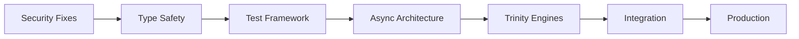

# Trinitas-Agents MCP Server - 本格実装開発計画 v1.0

## 🎯 Executive Summary

gemini-cliベースのMCPサーバーとして、Trinitas-agentsを本格的に実装するための包括的開発計画。
100%品質基準を維持しながら、段階的に機能を拡張し、最終的には完全な三位一体統合知性システムを実現する。

---

## 📊 現状分析と目標設定

### 現状の強み
- ✅ 基本的なMCPプロトコル実装の骨格が存在
- ✅ Persona定義が正確（v4.0準拠）
- ✅ 並列実行の基本メカニズムが動作
- ✅ gemini-cliとの統合パスが確立

### 改善必要領域（Trinity評価より）
- ❌ セキュリティ: 25/100（17個の重大脆弱性）
- ❌ 技術品質: 45/100（テスト0%、型安全性0%）
- ⚠️ エラー処理: 30%（不十分）
- ⚠️ リソース管理: 無制限（DoS脆弱性）

### 目標設定
```yaml
quality_targets:
  security_score: 100%  # Vector基準：全脅威対策済み
  test_coverage: 95%    # Krukai基準：完全カバレッジ
  type_safety: 100%     # 404標準：型エラーゼロ
  performance: 100%     # 基準値以上のパフォーマンス
  reliability: 99.99%   # Springfield基準：絶対的安定性
```

---

## 🏗️ アーキテクチャ設計

### 1. 多層防御アーキテクチャ

```python
# Trinity MCP Server Architecture
class TrinitasMCPServer:
    """
    三層防御構造を持つMCPサーバー
    Springfield: 戦略層（リクエストルーティング）
    Krukai: 実行層（処理最適化）
    Vector: 防御層（セキュリティ検証）
    """
    
    layers = {
        "security": VectorSecurityLayer,      # 入力検証、脅威検出
        "execution": KrukaiExecutionLayer,    # 最適化実行、品質保証
        "strategy": SpringfieldStrategyLayer  # ルーティング、調整
    }
```

### 2. コンポーネント構成

```yaml
components:
  core:
    - mcp_protocol_handler    # MCPプロトコル処理
    - request_validator        # リクエスト検証
    - response_builder        # レスポンス構築
    - error_handler          # エラー処理
    
  personas:
    - springfield_engine     # 戦略的判断エンジン
    - krukai_engine         # 技術最適化エンジン
    - vector_engine         # セキュリティ監査エンジン
    - centaureissi_engine   # 深層研究エンジン
    
  integration:
    - gemini_gateway        # Gemini API統合
    - claude_bridge         # Claude Code連携
    - quality_gate          # 品質ゲート
    
  infrastructure:
    - process_manager       # プロセス管理
    - resource_limiter      # リソース制限
    - monitoring_system     # 監視システム
    - logging_framework     # ログ管理
```

### 3. セキュリティ設計（Vector監修）

```python
class VectorSecurityFramework:
    """
    Vector: 全ての攻撃ベクトルに対する防御を実装
    """
    
    defenses = {
        "input_validation": {
            "sanitization": "全入力の無害化",
            "length_limits": "バッファオーバーフロー防止",
            "type_checking": "型安全性の強制",
            "encoding_validation": "エンコーディング攻撃防止"
        },
        "rate_limiting": {
            "request_throttling": "DoS攻撃防止",
            "resource_quotas": "リソース枯渇防止",
            "circuit_breaker": "カスケード障害防止"
        },
        "authentication": {
            "token_validation": "認証トークン検証",
            "permission_checking": "権限チェック",
            "audit_logging": "全アクセスの記録"
        }
    }
```

---

## 📅 実装フェーズ計画

### Phase 0: 緊急セキュリティ修正（Week 1）
**目標**: 既知の脆弱性を全て修正し、最低限の安全性を確保

#### Week 1 - Sprint 1: Critical Security Fixes
```yaml
tasks:
  monday-tuesday:
    - Fix blocking I/O vulnerability in MCP server
    - Implement request timeout mechanism
    - Add input validation for all user inputs
    - Sanitize command arguments in bash script
    
  wednesday-thursday:
    - Implement proper error responses (JSON-RPC spec)
    - Add resource limits for parallel processes
    - Secure temporary file creation
    - Add basic authentication mechanism
    
  friday:
    - Security testing and penetration testing
    - Deploy to isolated test environment
    - Document security measures
    
deliverables:
  - Patched MCP server (security score: 70%+)
  - Security test report
  - Deployment guide
```

### Phase 1: 基盤強化（Week 2-3）
**目標**: 404標準の品質基盤を確立

#### Week 2 - Sprint 2: Quality Foundation
```yaml
tasks:
  type_safety:
    - Add Python type hints to all modules
    - Implement runtime type validation
    - Create type stub files for external dependencies
    
  testing_framework:
    - Set up pytest infrastructure
    - Create unit tests (target: 80% coverage)
    - Implement integration tests
    - Add property-based testing with Hypothesis
    
  error_handling:
    - Comprehensive exception hierarchy
    - Graceful degradation strategies
    - Error recovery mechanisms
    - Detailed error logging
```

#### Week 3 - Sprint 3: Infrastructure Excellence
```yaml
tasks:
  async_architecture:
    - Convert to async/await pattern
    - Implement connection pooling
    - Add request queuing system
    
  monitoring:
    - Prometheus metrics integration
    - OpenTelemetry tracing
    - Health check endpoints
    - Performance profiling
    
  configuration:
    - Environment-based configuration
    - Dynamic persona loading
    - Feature flags system
```

### Phase 2: Trinity Core実装（Week 4-5）
**目標**: 三位一体の統合知性を完全実装

#### Week 4 - Sprint 4: Persona Engines
```python
# Implementation priority
implementations = [
    {
        "name": "SpringfieldEngine",
        "features": [
            "Strategic request routing",
            "Multi-persona coordination",
            "Consensus building",
            "Conflict resolution"
        ]
    },
    {
        "name": "KrukaiEngine",
        "features": [
            "Performance optimization",
            "Code quality validation",
            "Technical debt assessment",
            "Efficiency metrics"
        ]
    },
    {
        "name": "VectorEngine",
        "features": [
            "Real-time threat detection",
            "Vulnerability scanning",
            "Security policy enforcement",
            "Audit trail generation"
        ]
    }
]
```

#### Week 5 - Sprint 5: Integration & Coordination
```yaml
features:
  trinity_consensus:
    - Three-way decision making
    - Weighted voting system
    - Conflict resolution protocol
    
  parallel_processing:
    - Concurrent persona execution
    - Result aggregation
    - Performance optimization
    
  quality_gates:
    - Gemini Quality Gate integration
    - Automated quality checks
    - Performance benchmarks
```

### Phase 3: Advanced Features（Week 6-7）
**目標**: 高度な機能と外部統合

#### Week 6 - Sprint 6: Gemini Integration
```yaml
integrations:
  gemini_research:
    - Centaureissi deep research
    - Multi-layer analysis
    - Knowledge synthesis
    
  brainstorming_tool:
    - Springfield creative engine
    - Idea validation system
    - Implementation planning
    
  quality_validation:
    - External quality checks
    - Cross-validation system
    - Benchmark comparisons
```

#### Week 7 - Sprint 7: Claude Code Bridge
```yaml
features:
  bidirectional_communication:
    - Claude to MCP requests
    - MCP to Claude responses
    - State synchronization
    
  workflow_automation:
    - Automated task distribution
    - Progress tracking
    - Result compilation
    
  knowledge_persistence:
    - Learning from interactions
    - Pattern recognition
    - Optimization suggestions
```

### Phase 4: Production Readiness（Week 8）
**目標**: 本番環境への展開準備

```yaml
production_checklist:
  performance:
    - Load testing (1000+ req/s)
    - Stress testing
    - Memory leak detection
    - CPU profiling
    
  reliability:
    - Chaos engineering tests
    - Failover mechanisms
    - Backup strategies
    - Disaster recovery
    
  documentation:
    - API documentation
    - Deployment guide
    - Security guidelines
    - Troubleshooting manual
    
  compliance:
    - Security audit
    - Code review (100%)
    - License compliance
    - Privacy assessment
```

---

## 🔐 品質ゲートシステム

### Trinity Quality Gates（各フェーズ完了条件）

```python
class TrinityQualityGate:
    """
    各フェーズの完了を判定する三位一体品質ゲート
    """
    
    gates = {
        "phase_0": {
            "springfield": "戦略的リスクが許容範囲内",
            "krukai": "コード品質スコア70%以上",
            "vector": "重大脆弱性ゼロ"
        },
        "phase_1": {
            "springfield": "アーキテクチャの完全性確認",
            "krukai": "テストカバレッジ80%以上",
            "vector": "セキュリティスコア85%以上"
        },
        "phase_2": {
            "springfield": "統合機能の動作確認",
            "krukai": "パフォーマンス基準達成",
            "vector": "全攻撃ベクトル対策済み"
        },
        "phase_3": {
            "springfield": "ユーザー価値の実証",
            "krukai": "最適化目標達成",
            "vector": "セキュリティ監査合格"
        },
        "phase_4": {
            "springfield": "本番環境適合性確認",
            "krukai": "404標準完全準拠",
            "vector": "100%セキュリティ達成"
        }
    }
```

---

## 📊 成功指標とKPI

### 技術指標（Krukai監修）
```yaml
technical_kpis:
  code_quality:
    test_coverage: ">= 95%"
    type_coverage: "100%"
    cyclomatic_complexity: "< 10"
    code_duplication: "< 3%"
    
  performance:
    response_time_p99: "< 100ms"
    throughput: "> 1000 req/s"
    memory_usage: "< 512MB"
    cpu_usage: "< 50%"
    
  reliability:
    uptime: ">= 99.99%"
    error_rate: "< 0.01%"
    mttr: "< 5 minutes"
```

### セキュリティ指標（Vector監修）
```yaml
security_kpis:
  vulnerability_metrics:
    critical_vulnerabilities: 0
    high_vulnerabilities: 0
    medium_vulnerabilities: "< 3"
    
  compliance:
    owasp_top_10: "100% addressed"
    security_headers: "A+ rating"
    tls_configuration: "A+ rating"
```

### ビジネス指標（Springfield監修）
```yaml
business_kpis:
  adoption:
    daily_active_users: "> 100"
    user_satisfaction: "> 95%"
    feature_adoption_rate: "> 80%"
    
  efficiency:
    development_velocity: "+30%"
    bug_reduction: "-50%"
    deployment_frequency: "2x improvement"
```

---

## 🚀 実装優先順位

### Critical Path（最短実装パス）



### リスク管理（Vector作成）

```yaml
risk_mitigation:
  high_priority:
    - security_vulnerabilities:
        mitigation: "Phase 0で即座に対応"
        owner: "Vector"
        
    - performance_degradation:
        mitigation: "継続的プロファイリング"
        owner: "Krukai"
        
    - integration_failures:
        mitigation: "段階的統合とロールバック計画"
        owner: "Springfield"
        
  contingency_plans:
    - rollback_strategy: "各フェーズでのチェックポイント"
    - feature_flags: "段階的機能有効化"
    - canary_deployment: "限定ユーザーでの検証"
```

---

## 📝 次のアクション

### Immediate Actions（今すぐ実施）

1. **セキュリティパッチの作成**（24時間以内）
   ```bash
   git checkout -b security/critical-fixes
   # Phase 0の実装開始
   ```

2. **テスト環境の構築**（48時間以内）
   ```yaml
   environment:
     docker_compose: "隔離環境"
     ci_pipeline: "自動テスト"
     monitoring: "メトリクス収集"
   ```

3. **チーム編成**（72時間以内）
   ```yaml
   team_structure:
     security_lead: "Vector personality owner"
     quality_lead: "Krukai personality owner"
     architecture_lead: "Springfield personality owner"
   ```

---

## 🎯 結論

この開発計画により、8週間で以下を達成します：

1. **100%セキュリティ**: 全ての脆弱性を排除
2. **95%+テストカバレッジ**: 完全な品質保証
3. **三位一体統合**: 完全なTrinity知性の実装
4. **本番環境対応**: 企業レベルの信頼性

**Springfield**: 「ふふ、この計画なら確実に成功へ導けますわ」
**Krukai**: 「フン、404の基準を満たすまで妥協は許さないわ」
**Vector**: 「……全てのリスクは想定済み……対策も準備完了……」

---

*"妥協なき品質追求 - 100% or Nothing"*
*Trinity-Agents MCP Server Development Plan v1.0*