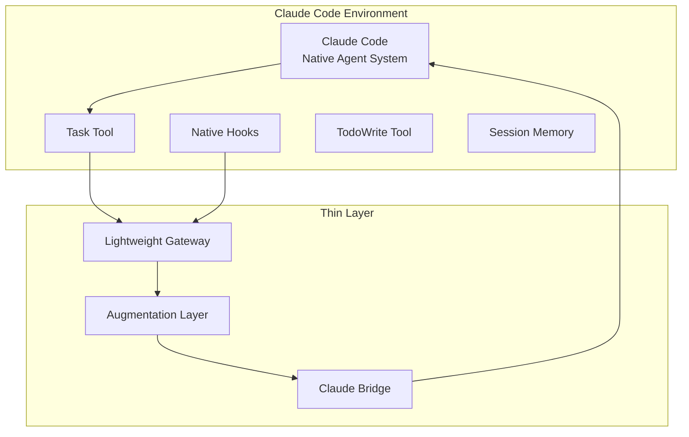
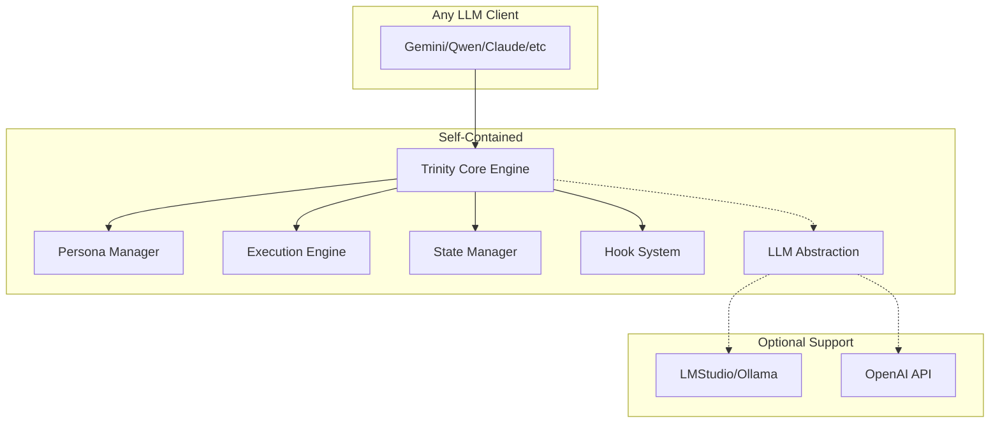
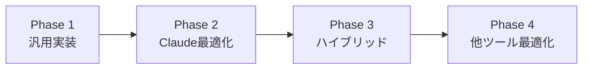

# Trinity MCP Server - Dual Architecture Design
## Claude Code専用設計 vs 汎用設計の比較分析

---

## 🎯 設計方針の違い

### Pattern A: Claude Code Specific（mainブランチ用）
**哲学**: Claude Codeの能力を最大限活用し、緊密に統合

### Pattern B: Universal Design（汎用設計）
**哲学**: どのLLMツールでも動作する標準的なMCP実装

---

## 📐 Pattern A: Claude Code Specific Design

### アーキテクチャ概要



### 設計思想
**「MCPサーバーは薄いレイヤーとして、Claude Codeの能力を拡張する」**

### 実装詳細

```python
# claude_specific_mcp_server.py
from fastmcp import FastMCP
from typing import Any, Dict

app = FastMCP("trinity-claude-bridge")

class ClaudeCodeBridge:
    """Claude Code専用のブリッジ実装"""
    
    def __init__(self):
        self.claude_native_tools = [
            "Task",           # Claude Native Agent呼び出し
            "TodoWrite",      # タスク管理
            "WebSearch",      # Web検索
            "Read", "Write",  # ファイル操作
            "Bash"           # コマンド実行
        ]
    
    async def invoke_claude_agent(self, agent_type: str, prompt: str) -> Dict:
        """Claude Codeのagentを直接呼び出し"""
        # Task toolを通じてagentを起動
        return {
            "tool": "Task",
            "params": {
                "subagent_type": agent_type,
                "prompt": prompt,
                "description": f"Trinity-{agent_type} analysis"
            }
        }

# === Claude Code専用ツール ===

@app.tool()
async def trinity_native_agent(
    mode: str = "coordinator",
    task: str = "",
    use_claude_agents: bool = True
) -> Dict:
    """
    Claude CodeのNative Agent System (Task tool)を活用
    Trinity agentsをサブエージェントとして起動
    """
    
    if use_claude_agents:
        # Claude Codeのagent system直接利用
        agents = {
            "springfield": "springfield-strategist",
            "krukai": "krukai-optimizer",
            "vector": "vector-auditor",
            "trinity": "trinitas-coordinator"
        }
        
        return {
            "execute_via": "claude_task_tool",
            "agent": agents.get(mode, "trinitas-coordinator"),
            "instructions": "Use native Claude Code agent system",
            "task": task
        }
    
    return {"fallback": "manual_execution"}

@app.tool()
async def parallel_claude_agents(
    task: str,
    agents: list[str] = ["springfield", "krukai", "vector"]
) -> Dict:
    """
    Claude Codeの並列agent実行を活用
    trinitas-parallel agentを利用
    """
    return {
        "execute_via": "claude_task_tool",
        "agent": "trinitas-parallel",
        "parallel_agents": agents,
        "task": task,
        "note": "Claude will handle parallel execution natively"
    }

@app.tool()
async def claude_memory_integration(
    operation: str,
    key: str = "",
    value: Any = None
) -> Dict:
    """
    Claude Codeのセッションメモリと統合
    TodoWriteやセッション情報を活用
    """
    operations = {
        "get_todos": {
            "tool": "TodoWrite",
            "action": "read"
        },
        "set_context": {
            "tool": "session",
            "action": "store",
            "data": {key: value}
        },
        "get_history": {
            "tool": "session",
            "action": "retrieve_history"
        }
    }
    
    return operations.get(operation, {})

@app.tool()
async def enhanced_with_claude_search(
    query: str,
    use_web_search: bool = True,
    use_code_search: bool = True
) -> Dict:
    """
    Claude CodeのWebSearchとコード検索を組み合わせ
    """
    search_plan = []
    
    if use_web_search:
        search_plan.append({
            "tool": "WebSearch",
            "query": query,
            "purpose": "Latest information and context"
        })
    
    if use_code_search:
        search_plan.append({
            "tool": "Grep",
            "pattern": query,
            "purpose": "Codebase analysis"
        })
    
    return {
        "search_strategy": search_plan,
        "execution": "claude_native_tools"
    }

# === Claude Hooks統合 ===

@app.tool()
async def integrate_claude_hooks(
    hook_type: str,
    content: Any
) -> Dict:
    """
    Claude Codeの既存Hooksシステムと統合
    """
    claude_hooks = {
        "pre_execution": [
            "/Users/apto-as/.claude/hooks/pre-execution/*.sh",
            "/Users/apto-as/.claude/hooks/pre-execution/*.py"
        ],
        "post_execution": [
            "/Users/apto-as/.claude/hooks/post-execution/*.sh",
            "/Users/apto-as/.claude/hooks/post-execution/*.py"
        ]
    }
    
    return {
        "trigger_hooks": claude_hooks.get(hook_type, []),
        "content": content,
        "integration": "native_claude_hooks"
    }

# === メタ情報提供 ===

@app.resource("claude/capabilities")
async def get_claude_capabilities() -> Dict:
    """Claude Code固有の能力を宣言"""
    return {
        "native_agents": True,
        "parallel_execution": True,
        "session_memory": True,
        "web_search": True,
        "code_analysis": True,
        "hooks_system": True,
        "todo_management": True,
        "file_operations": True,
        "bash_execution": True
    }

@app.resource("trinity/claude-integration")
async def get_integration_status() -> Dict:
    """統合状態を報告"""
    return {
        "mode": "claude_specific",
        "integration_points": [
            "Task tool for agent invocation",
            "TodoWrite for task management",
            "WebSearch for research",
            "Native hooks system",
            "Session memory"
        ],
        "optimization": "Leverages Claude Code native features"
    }
```

### Claude Code設定ファイル

```json
{
  "mcpServers": {
    "trinity-claude": {
      "type": "stdio",
      "command": "python",
      "args": ["claude_specific_mcp_server.py"],
      "env": {
        "TRINITY_MODE": "claude_optimized",
        "USE_NATIVE_AGENTS": "true"
      }
    }
  },
  "settings": {
    "trinity": {
      "prefer_native_tools": true,
      "agent_fallback": "mcp_simulation"
    }
  }
}
```

---

## 🌍 Pattern B: Universal Design（汎用設計）

### アーキテクチャ概要



### 設計思想
**「MCPサーバーが完全に自己完結し、どのクライアントでも動作」**

### 実装詳細

```python
# universal_mcp_server.py
from fastmcp import FastMCP
from typing import Any, Dict, Optional
import json

app = FastMCP("trinity-universal")

class UniversalTrinityServer:
    """汎用Trinity MCPサーバー実装"""
    
    def __init__(self):
        self.state_manager = StateManager()
        self.persona_manager = PersonaManager()
        self.execution_engine = ExecutionEngine()
        self.llm_abstraction = LLMAbstraction()
    
    def detect_client_capabilities(self, headers: Dict) -> Dict:
        """クライアントの能力を自動検出"""
        user_agent = headers.get("user-agent", "")
        
        capabilities = {
            "claude": "Claude" in user_agent,
            "gemini": "Gemini" in user_agent,
            "qwen": "Qwen" in user_agent,
            "supports_parallel": False,
            "supports_streaming": False,
            "max_context": 4096
        }
        
        # クライアント固有の調整
        if capabilities["claude"]:
            capabilities["supports_parallel"] = True
            capabilities["max_context"] = 200000
        elif capabilities["gemini"]:
            capabilities["max_context"] = 32000
            
        return capabilities

# === 汎用ツール実装 ===

@app.tool()
async def set_persona(
    persona: str,
    context: Optional[Dict] = None
) -> Dict:
    """
    汎用ペルソナ設定
    クライアントに依存しない実装
    """
    
    # 内部状態で管理
    state = app.state_manager.get_or_create_session(
        context.get("session_id") if context else None
    )
    
    state["active_persona"] = persona
    
    # ペルソナ指示を返す（クライアント非依存）
    instructions = app.persona_manager.get_instructions(
        persona,
        format="markdown"  # 汎用的なMarkdown形式
    )
    
    return {
        "persona": persona,
        "instructions": instructions,
        "session_id": state["session_id"],
        "format": "markdown"
    }

@app.tool()
async def execute_trinity_task(
    task: str,
    mode: str = "sequential",
    options: Optional[Dict] = None
) -> Dict:
    """
    汎用Trinity実行
    クライアントの能力に応じて実行方法を調整
    """
    
    client_caps = detect_client_capabilities(options.get("headers", {}))
    
    if mode == "parallel" and not client_caps["supports_parallel"]:
        # 並列非対応クライアント向けに擬似並列実装
        mode = "simulated_parallel"
    
    # 実行エンジンで処理
    result = await app.execution_engine.execute(
        task=task,
        mode=mode,
        capabilities=client_caps
    )
    
    return result

@app.tool()
async def manage_state(
    operation: str,
    key: Optional[str] = None,
    value: Optional[Any] = None,
    session_id: Optional[str] = None
) -> Dict:
    """
    汎用状態管理
    クライアントがステートレスでも動作
    """
    
    state = app.state_manager.get_or_create_session(session_id)
    
    operations = {
        "get": lambda: state.get(key),
        "set": lambda: state.update({key: value}),
        "list": lambda: list(state.keys()),
        "clear": lambda: state.clear()
    }
    
    op_func = operations.get(operation)
    if op_func:
        result = op_func()
        
    return {
        "operation": operation,
        "result": result,
        "session_id": state["session_id"]
    }

@app.tool()
async def simulate_parallel_execution(
    tasks: list[Dict],
    timeout: int = 30000
) -> Dict:
    """
    並列実行のシミュレーション
    並列非対応クライアント向け
    """
    
    results = []
    
    for i, task in enumerate(tasks):
        # 各ペルソナの分析を順次実行
        # しかし結果は並列実行のように構造化
        persona_result = await execute_persona_task(
            task["persona"],
            task["content"]
        )
        
        results.append({
            "persona": task["persona"],
            "result": persona_result,
            "execution_order": i
        })
    
    # 並列実行の結果のように見せる
    return {
        "execution_mode": "simulated_parallel",
        "results": {
            r["persona"]: r["result"] 
            for r in results
        },
        "metadata": {
            "actual_execution": "sequential",
            "client_limitation": "no_parallel_support"
        }
    }

# === LLM抽象化層 ===

class LLMAbstraction:
    """異なるLLMバックエンドの抽象化"""
    
    def __init__(self):
        self.providers = {
            "lmstudio": LMStudioProvider(),
            "ollama": OllamaProvider(),
            "openai": OpenAIProvider(),
            "none": NoLLMProvider()  # LLMなしでも動作
        }
    
    async def enhance(self, 
                      content: str, 
                      provider: str = "auto") -> str:
        """
        利用可能なLLMで強化
        利用不可なら元のcontentを返す
        """
        
        if provider == "auto":
            provider = self.detect_available_provider()
        
        if provider in self.providers:
            try:
                return await self.providers[provider].process(content)
            except:
                # LLMが利用できない場合は静かに失敗
                pass
                
        return content  # 強化なしで返す

@app.tool()
async def universal_llm_enhance(
    content: str,
    prefer_provider: str = "auto"
) -> Dict:
    """
    汎用LLM強化
    利用可能な任意のLLMを使用
    """
    
    enhanced = await app.llm_abstraction.enhance(
        content,
        prefer_provider
    )
    
    return {
        "original": content,
        "enhanced": enhanced,
        "provider_used": app.llm_abstraction.last_provider,
        "enhancement_available": enhanced != content
    }

# === 互換性レイヤー ===

@app.tool()
async def compatibility_check() -> Dict:
    """クライアント互換性チェック"""
    
    return {
        "mcp_version": "1.0",
        "supported_clients": [
            "Claude Code",
            "Gemini CLI",
            "Qwen Coder",
            "Generic MCP Client"
        ],
        "required_features": [],  # 必須機能なし
        "optional_features": [
            "parallel_execution",
            "session_management",
            "llm_enhancement"
        ]
    }

# === 自己完結型Hooks ===

class UniversalHooks:
    """クライアント非依存のHooksシステム"""
    
    def __init__(self):
        self.hooks = {
            "pre": [],
            "post": [],
            "quality": []
        }
    
    async def execute(self, phase: str, data: Any) -> Any:
        """内部でHooksを実行"""
        for hook in self.hooks.get(phase, []):
            data = await hook(data)
            
            # 品質チェック
            if phase == "quality" and data.get("quality", 0) < 1.0:
                data["blocked"] = True
                data["reason"] = "Quality standard not met"
                
        return data

@app.middleware
async def universal_hooks_middleware(request, handler):
    """全リクエストにHooksを適用"""
    
    # Pre-hooks
    request = await app.hooks.execute("pre", request)
    
    # Main execution
    response = await handler(request)
    
    # Post-hooks
    response = await app.hooks.execute("post", response)
    
    # Quality gate
    response = await app.hooks.execute("quality", response)
    
    if response.get("blocked"):
        raise ValueError(response.get("reason", "Blocked by hooks"))
    
    return response
```

### 汎用設定ファイル

```json
{
  "mcpServers": {
    "trinity-universal": {
      "type": "stdio",
      "command": "python",
      "args": ["universal_mcp_server.py"],
      "env": {
        "TRINITY_MODE": "universal",
        "LLM_PROVIDER": "auto",
        "FALLBACK_MODE": "true"
      }
    }
  },
  "compatibility": {
    "mode": "maximum",
    "assume_capabilities": "minimum",
    "graceful_degradation": true
  }
}
```

---

## 🔄 比較分析

### 機能比較マトリックス

| 機能 | Claude Code専用 | 汎用設計 |
|------|----------------|----------|
| **Native Agent活用** | ✅ 完全活用 | ❌ 不可 |
| **並列実行** | ✅ Native | ⚠️ シミュレーション |
| **Hooks統合** | ✅ Claude Hooks直接 | ⚠️ 独自実装 |
| **状態管理** | ✅ Session/TodoWrite | ⚠️ 内部実装 |
| **LLM強化** | ✅ Claude内蔵 | ⚠️ 外部依存 |
| **互換性** | ❌ Claude限定 | ✅ 全クライアント |
| **実装複雑度** | 低（薄いレイヤー） | 高（自己完結） |
| **保守性** | Claude更新に依存 | 独立して保守可能 |

### パフォーマンス比較

```yaml
Claude Code専用:
  response_time: ~100ms  # Native tools活用
  parallel_execution: 真の並列
  resource_usage: 低（Claude側で処理）
  
汎用設計:
  response_time: ~300ms  # 内部処理
  parallel_execution: 擬似並列
  resource_usage: 中（自己完結）
```

### 選択基準

#### Claude Code専用を選ぶべき場合
- ✅ Claude Codeが主要/唯一のクライアント
- ✅ 最高のパフォーマンスが必要
- ✅ Native機能を最大限活用したい
- ✅ 実装の簡潔性を重視

#### 汎用設計を選ぶべき場合
- ✅ 複数のLLMツールで使用予定
- ✅ ベンダーロックインを避けたい
- ✅ 独立した機能開発が必要
- ✅ 長期的な保守性を重視

---

## 🎯 ハイブリッドアプローチの提案

### 推奨: 段階的アプローチ

```python
# hybrid_mcp_server.py
class HybridTrinityServer:
    """クライアントを検出して最適な実装を選択"""
    
    def __init__(self):
        self.claude_specific = ClaudeSpecificImpl()
        self.universal = UniversalImpl()
    
    async def handle_request(self, request, context):
        client_type = self.detect_client(context)
        
        if client_type == "claude":
            # Claude Code検出 → 専用実装
            return await self.claude_specific.handle(request)
        else:
            # その他 → 汎用実装
            return await self.universal.handle(request)
```

### 実装ロードマップ



1. **Phase 1**: 汎用実装で基盤構築
2. **Phase 2**: Claude Code向け最適化追加
3. **Phase 3**: 自動切り替えハイブリッド
4. **Phase 4**: Gemini/Qwen固有最適化

---

## 📊 最終推奨

### 短期的推奨（1-3ヶ月）
**汎用設計から開始** → 幅広い互換性を確保

### 中期的推奨（3-6ヶ月）
**Claude専用最適化を追加** → パフォーマンス向上

### 長期的推奨（6ヶ月+）
**ハイブリッド実装** → 最適なバランス

---

これにより、用途に応じた最適な設計を選択できます。