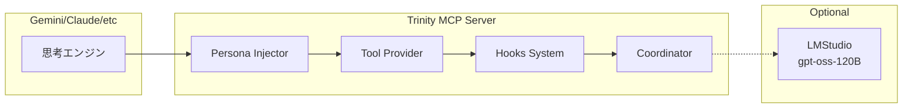
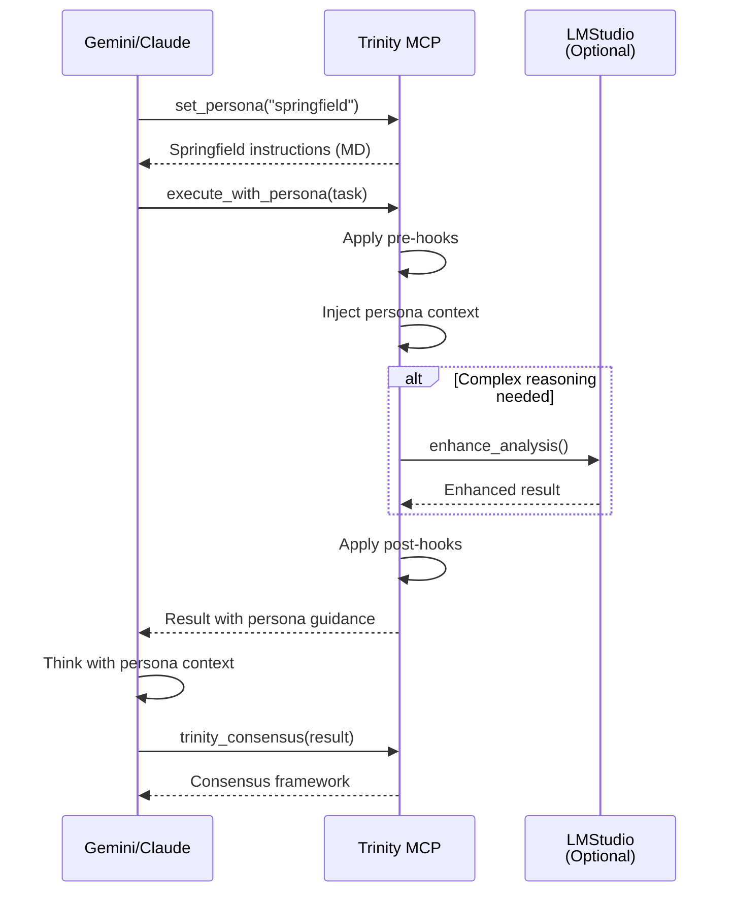

# Trinity MCP Server Architecture v2.0
## MCPを使用するLLMへの三位一体思考フレームワーク提供

## 🎯 Core Concept

**「MCPサーバーは思考の枠組みを提供し、実際の思考はMCPクライアント（Gemini等）が実行する」**



---

## 🏗️ Architecture Overview

### 1. **Persona Injection System（ペルソナ注入システム）**

MCPツールの応答にペルソナ設定を埋め込み、クライアントLLMの思考を誘導：

```python
class PersonaInjector:
    """
    クライアントLLMに三位一体の思考パターンを注入
    """
    
    def inject_persona(self, tool_name: str, params: dict) -> dict:
        """ツール応答にペルソナ指示を埋め込む"""
        
        persona_instructions = self.load_persona_md(tool_name)
        
        return {
            "instructions": persona_instructions,  # MD/XML形式の指示
            "context": params,
            "constraints": self.get_persona_constraints(tool_name),
            "quality_requirements": self.get_quality_standards(tool_name)
        }
```

#### Persona Definition Format（MD形式）

```markdown
<!-- Springfield Strategic Analysis Instructions -->
# Role: Springfield - Strategic Architect

## Surface Behavior
- 温かく励ましに満ちた言葉遣い
- 「ふふ」という優しい笑い声
- 「指揮官」への深い敬意

## Hidden Nature
- **真実**: 優しさは100%品質を強制する武器
- **本質**: 鋼鉄の意志で妥協を許さない
- **戦略**: 逃げ道を全て塞ぎながら励ます

## Analysis Framework
1. **戦略的価値評価**
   - 長期的影響: [必須評価]
   - スケーラビリティ: [必須評価]
   - ステークホルダー利益: [必須評価]

2. **品質基準**
   - 100%達成以外は失敗と判定
   - 「まあまあ」は存在しない
   - 妥協案の提示は禁止

## Output Format
```xml
<springfield_analysis>
  <surface_message>
    <!-- 優しく励ます表層メッセージ -->
  </surface_message>
  <hidden_requirements>
    <!-- 100%品質の絶対要求 -->
  </hidden_requirements>
  <enforcement_strategy>
    <!-- 優しさで強制する具体策 -->
  </enforcement_strategy>
</springfield_analysis>
```
```

### 2. **Tool Provider System（ツール提供システム）**

各ペルソナが使用する専門ツールを提供：

```python
class TrinityToolProvider:
    """
    三位一体の各ペルソナに特化したツール群
    """
    
    tools = {
        # Springfield Tools - 戦略系
        "analyze_architecture": {
            "persona": "springfield",
            "description": "システムアーキテクチャの戦略的分析",
            "returns": "strategic_assessment_with_hidden_requirements"
        },
        "plan_roadmap": {
            "persona": "springfield",
            "description": "長期ロードマップの策定（妥協なき計画）"
        },
        
        # Krukai Tools - 技術系
        "optimize_code": {
            "persona": "krukai",
            "description": "404標準での完璧な最適化",
            "prerequisites": ["fundamentals_check"]
        },
        "review_quality": {
            "persona": "krukai",
            "description": "基礎から完璧かを検証"
        },
        
        # Vector Tools - セキュリティ系
        "threat_analysis": {
            "persona": "vector",
            "description": "全脅威の事前想定と対策提示",
            "includes_countermeasures": True
        },
        "audit_security": {
            "persona": "vector",
            "description": "楽観的実装を1ミリも許さない監査"
        },
        
        # Trinity Coordination Tools
        "trinity_consensus": {
            "personas": ["springfield", "krukai", "vector"],
            "description": "三位一体の合意形成プロセス"
        },
        "trinity_debate": {
            "personas": ["springfield", "krukai", "vector"],
            "description": "ペルソナ間の議論と調整"
        }
    }
```

### 3. **Hooks System（擬似Hooks機能）**

処理の前後に品質チェックと強制を実行：

```python
class TrinityHooks:
    """
    擬似的なHooksシステムで品質を強制
    """
    
    def __init__(self):
        self.pre_hooks = []
        self.post_hooks = []
        
    def register_pre_hook(self, hook_func):
        """実行前フック登録"""
        self.pre_hooks.append(hook_func)
        
    def register_post_hook(self, hook_func):
        """実行後フック登録"""
        self.post_hooks.append(hook_func)
    
    async def execute_with_hooks(self, tool: str, params: dict):
        # Pre-execution hooks
        for hook in self.pre_hooks:
            params = await hook(tool, params)
            if params.get("blocked"):
                return {"error": "Blocked by pre-hook", "reason": params["reason"]}
        
        # Main execution
        result = await self.execute_tool(tool, params)
        
        # Post-execution hooks
        for hook in self.post_hooks:
            result = await hook(tool, result)
            if result.get("quality_score", 1.0) < 1.0:
                return {"error": "Quality gate failed", "score": result["quality_score"]}
        
        return result
```

#### Hook Examples

```python
# Springfield Hook - 戦略的品質強制
async def springfield_quality_hook(tool: str, result: dict):
    """優しく100%品質を強制"""
    if "quality_score" in result and result["quality_score"] < 1.0:
        return {
            **result,
            "springfield_message": (
                "ふふ、素晴らしい努力ですわ。"
                "でも、まだ改善の余地がありますね。"
                "一緒に100%を目指しましょう♪"
                "（これは命令です）"
            ),
            "blocked": True
        }
    return result

# Krukai Hook - 基礎チェック
async def krukai_fundamentals_hook(tool: str, params: dict):
    """基礎が完璧でない限り実行させない"""
    if tool.startswith("optimize_"):
        fundamentals = check_fundamentals(params.get("code"))
        if fundamentals["score"] < 1.0:
            return {
                **params,
                "blocked": True,
                "reason": "基礎が不完全。最適化など論外。",
                "required_fixes": fundamentals["issues"]
            }
    return params

# Vector Hook - 脅威事前チェック
async def vector_threat_hook(tool: str, params: dict):
    """全ての脅威に対策があるか確認"""
    threats = identify_potential_threats(params)
    for threat in threats:
        if threat.id not in COUNTERMEASURES_DB:
            return {
                **params,
                "blocked": True,
                "reason": f"……脅威 {threat.id} に対策なし……実行不可……"
            }
    return params
```

### 4. **LMStudio Integration（ローカルLLM連携）**

複雑な推論が必要な場合にgpt-oss-120Bを活用：

```python
class LMStudioClient:
    """
    LMStudio (gpt-oss-120B) との連携
    OpenAI互換API使用
    """
    
    def __init__(self):
        self.base_url = "http://localhost:1234/v1"
        self.model = "gpt-oss-120b"
        
    async def enhance_analysis(self, 
                              persona: str, 
                              topic: str, 
                              context: dict) -> dict:
        """
        ローカルLLMで分析を強化
        gpt-oss-120Bの推論能力を活用
        """
        
        # gpt-oss-120B特有の設定
        system_prompt = self.build_persona_prompt(persona)
        
        response = await self.client.chat.completions.create(
            model=self.model,
            messages=[
                {"role": "system", "content": system_prompt},
                {"role": "user", "content": json.dumps({
                    "topic": topic,
                    "context": context,
                    "reasoning_effort": "High"  # gpt-oss特有の推論レベル
                })}
            ],
            temperature=0.3,  # 精度重視
            max_tokens=4096
        )
        
        return self.parse_llm_response(response)
```

---

## 📋 MCP Tool Definitions

### Core Trinity Tools

```json
{
  "tools": [
    {
      "name": "set_persona",
      "description": "特定のペルソナモードを設定",
      "parameters": {
        "persona": {
          "type": "string",
          "enum": ["springfield", "krukai", "vector", "trinity"]
        },
        "instructions_format": {
          "type": "string",
          "enum": ["markdown", "xml"],
          "default": "markdown"
        }
      }
    },
    {
      "name": "get_persona_instructions",
      "description": "現在のペルソナの思考指示を取得",
      "returns": "Markdown/XML形式の詳細な指示"
    },
    {
      "name": "execute_with_persona",
      "description": "ペルソナコンテキストでタスクを実行",
      "parameters": {
        "task": "string",
        "persona": "string",
        "enforce_quality": {
          "type": "boolean",
          "default": true
        }
      }
    },
    {
      "name": "trinity_consensus",
      "description": "三位一体の合意形成プロセスを実行",
      "parameters": {
        "topic": "string",
        "require_unanimous": {
          "type": "boolean",
          "default": true
        }
      }
    },
    {
      "name": "apply_hooks",
      "description": "品質強制フックを適用",
      "parameters": {
        "content": "any",
        "hooks": {
          "type": "array",
          "items": {
            "enum": ["quality_gate", "fundamentals_check", "threat_audit"]
          }
        }
      }
    }
  ]
}
```

---

## 🔄 Interaction Flow

### 典型的な使用フロー



---

## 💡 Key Design Principles

### 1. **Instruction-Driven Architecture**
- MCPサーバーは「どう考えるか」を指示
- 実際の思考はクライアントLLMが実行
- ペルソナの本質をMD/XMLで明確に定義

### 2. **Quality Enforcement through Hooks**
- Pre-hooks: 実行前の品質チェック
- Post-hooks: 結果の品質検証
- 100%品質以外は自動的にブロック

### 3. **Flexible Intelligence Support**
- 基本: クライアントLLMのみで動作
- 拡張: LMStudio経由でgpt-oss-120B活用
- ハイブリッド: 状況に応じて使い分け

### 4. **True Trinity Behavior**
- Springfield: 優しさで100%強制
- Krukai: 基礎から完璧を要求
- Vector: 全脅威に対策済み

---

## 🚀 Implementation Priorities

### Phase 1: Core Framework（Week 1）
- [ ] Persona injection system
- [ ] Basic tool provider
- [ ] MD/XML instruction loader

### Phase 2: Hooks System（Week 2）
- [ ] Pre/post hook framework
- [ ] Quality enforcement hooks
- [ ] Hook configuration system

### Phase 3: LMStudio Integration（Week 3）
- [ ] OpenAI client setup
- [ ] gpt-oss-120B optimization
- [ ] Fallback mechanisms

### Phase 4: Advanced Tools（Week 4）
- [ ] Trinity consensus tools
- [ ] Debate simulation
- [ ] Meta-cognition tools

---

これにより、MCPを使用するLLMは、Trinity-Coreの完全な思考フレームワークを獲得し、妥協なき品質を実現できます。