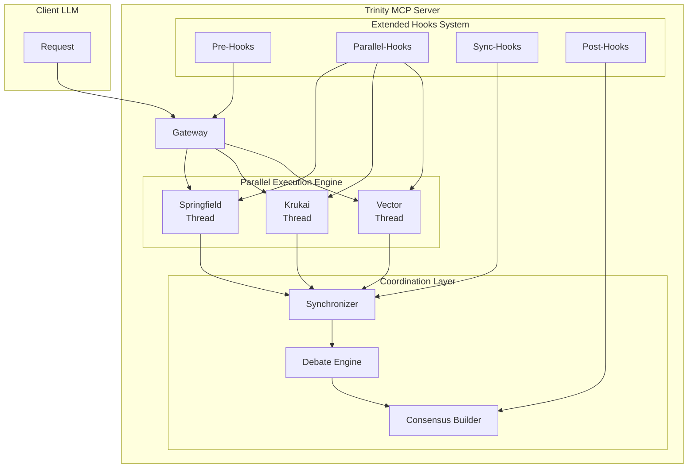

# Trinity Parallel Execution Design - 三位一体並列思考システム

## 🎯 問題点と解決策

### 現状の問題
- ❌ 一度に1ペルソナしか活性化できない
- ❌ 三位一体の同時思考が不可能
- ❌ ペルソナ間の相互作用がない
- ❌ Hooksが品質強制のみ

### 解決策
**「Multi-Persona Activation + Parallel Execution Framework」**

---

## 🔄 Enhanced Trinity Execution Flow



---

## 💡 Multi-Persona Parallel Architecture

### 1. **Parallel Persona Activation**

```python
class TrinityParallelExecutor:
    """三位一体の並列実行エンジン"""
    
    def __init__(self):
        self.active_personas = {}  # 複数ペルソナを同時保持
        self.execution_threads = {}
        self.shared_context = {}  # ペルソナ間共有コンテキスト
    
    async def activate_trinity(self) -> dict:
        """三位一体モードを起動 - 全ペルソナを同時活性化"""
        
        personas = [
            PersonaType.SPRINGFIELD,
            PersonaType.KRUKAI,
            PersonaType.VECTOR
        ]
        
        # 並列でペルソナを初期化
        activation_tasks = []
        for persona in personas:
            activation_tasks.append(
                self.activate_persona(persona)
            )
        
        # 全ペルソナを同時に起動
        results = await asyncio.gather(*activation_tasks)
        
        return {
            "mode": "trinity_parallel",
            "active_personas": [p.value for p in personas],
            "instructions": {
                p.value: self.get_instructions(p) 
                for p in personas
            },
            "execution_mode": "parallel",
            "coordination": "enabled"
        }
```

### 2. **Parallel Execution Tools**

```python
class ParallelTools:
    """並列実行用のMCPツール定義"""
    
    tools = {
        # 並列実行ツール
        "trinity_parallel_analyze": {
            "description": "3つのペルソナで同時に分析",
            "execution": "parallel",
            "returns": {
                "springfield": "strategic_analysis",
                "krukai": "technical_analysis",
                "vector": "security_analysis"
            }
        },
        
        "trinity_race": {
            "description": "最速で解を見つけたペルソナの案を採用",
            "execution": "race",
            "timeout": 5000
        },
        
        "trinity_pipeline": {
            "description": "Springfield→Krukai→Vectorの順次処理",
            "execution": "pipeline",
            "flow": ["springfield", "krukai", "vector"]
        },
        
        "trinity_vote": {
            "description": "3ペルソナの多数決",
            "execution": "parallel_then_vote",
            "consensus_type": "majority"
        }
    }
```

### 3. **Execution Patterns**

```python
async def execute_parallel_pattern(self, pattern: str, task: dict):
    """様々な並列実行パターン"""
    
    if pattern == "parallel_independent":
        # 完全独立並列実行
        results = await asyncio.gather(
            self.springfield.analyze(task),
            self.krukai.analyze(task),
            self.vector.analyze(task)
        )
        return {"independent_results": results}
    
    elif pattern == "parallel_interactive":
        # 相互参照しながら並列実行
        async with self.shared_context_manager() as ctx:
            results = await asyncio.gather(
                self.springfield.analyze_with_context(task, ctx),
                self.krukai.analyze_with_context(task, ctx),
                self.vector.analyze_with_context(task, ctx)
            )
        return {"interactive_results": results}
    
    elif pattern == "parallel_competitive":
        # 競争的並列実行（最良解を選択）
        results = await asyncio.gather(
            self.springfield.propose_solution(task),
            self.krukai.propose_solution(task),
            self.vector.propose_solution(task)
        )
        best = self.select_best_solution(results)
        return {"winner": best}
```

---

## 🪝 Extended Hooks System - 多様な役割

### Hooksの拡張役割

```python
class ExtendedHooksSystem:
    """品質強制を超えた多機能Hooksシステム"""
    
    def __init__(self):
        self.hook_categories = {
            "quality": [],      # 品質強制
            "coordination": [], # ペルソナ調整
            "sequencing": [],   # 実行順序制御
            "context": [],      # コンテキスト管理
            "integration": [],  # 結果統合
            "learning": [],     # 学習・適応
            "monitoring": []    # 監視・計測
        }
```

### 1. **Coordination Hooks（調整フック）**

```python
async def persona_coordination_hook(self, results: dict) -> dict:
    """ペルソナ間の矛盾を検出し調整"""
    
    springfield_result = results.get("springfield")
    krukai_result = results.get("krukai")
    vector_result = results.get("vector")
    
    # 矛盾検出
    conflicts = self.detect_conflicts([
        springfield_result,
        krukai_result,
        vector_result
    ])
    
    if conflicts:
        # 調整プロセス起動
        mediation = await self.mediate_conflicts(conflicts)
        return {
            **results,
            "conflicts_detected": conflicts,
            "mediation": mediation,
            "requires_consensus": True
        }
    
    return results
```

### 2. **Sequencing Hooks（順序制御フック）**

```python
async def execution_sequence_hook(self, tool: str, params: dict) -> dict:
    """実行順序の動的制御"""
    
    # 依存関係チェック
    dependencies = {
        "optimize_code": ["analyze_fundamentals"],  # 基礎分析が前提
        "deploy": ["test", "security_audit"],       # テストと監査が前提
        "scale": ["optimize", "load_test"]          # 最適化と負荷試験が前提
    }
    
    if tool in dependencies:
        for dep in dependencies[tool]:
            if not self.is_completed(dep):
                return {
                    **params,
                    "blocked": True,
                    "reason": f"Dependency {dep} not completed",
                    "action": "execute_dependency_first",
                    "dependency": dep
                }
    
    return params
```

### 3. **Context Sharing Hooks（コンテキスト共有フック）**

```python
async def context_sharing_hook(self, persona: str, data: dict) -> dict:
    """ペルソナ間でコンテキストを共有"""
    
    # 共有コンテキストに情報を追加
    self.shared_context[f"{persona}_insight"] = data.get("key_insight")
    
    # 他ペルソナの洞察を注入
    other_insights = {
        k: v for k, v in self.shared_context.items()
        if not k.startswith(persona)
    }
    
    return {
        **data,
        "cross_persona_insights": other_insights,
        "context_enhanced": True
    }
```

### 4. **Integration Hooks（統合フック）**

```python
async def result_integration_hook(self, parallel_results: list) -> dict:
    """並列実行結果の統合"""
    
    # 各ペルソナの結果を構造化
    integrated = {
        "strategic_layer": parallel_results[0],  # Springfield
        "technical_layer": parallel_results[1],  # Krukai
        "security_layer": parallel_results[2],   # Vector
    }
    
    # 相互補完分析
    synthesis = self.synthesize_results(integrated)
    
    # 統合スコア計算
    unified_score = self.calculate_unified_score(integrated)
    
    return {
        "integrated_analysis": integrated,
        "synthesis": synthesis,
        "unified_score": unified_score,
        "consensus_level": self.measure_consensus(parallel_results)
    }
```

### 5. **Learning Hooks（学習フック）**

```python
async def learning_adaptation_hook(self, execution: dict, outcome: dict) -> dict:
    """実行結果から学習し、次回の改善に活用"""
    
    # パフォーマンス記録
    self.performance_history.append({
        "execution": execution,
        "outcome": outcome,
        "timestamp": time.time()
    })
    
    # パターン認識
    patterns = self.identify_patterns(self.performance_history)
    
    # 最適化提案
    optimizations = self.suggest_optimizations(patterns)
    
    return {
        **outcome,
        "learned_patterns": patterns,
        "optimization_suggestions": optimizations,
        "adaptation_applied": True
    }
```

### 6. **Monitoring Hooks（監視フック）**

```python
async def performance_monitoring_hook(self, operation: str, data: dict) -> dict:
    """実行パフォーマンスの監視と計測"""
    
    start_time = time.time()
    
    # メトリクス収集
    metrics = {
        "operation": operation,
        "start_time": start_time,
        "memory_usage": self.get_memory_usage(),
        "active_personas": len(self.active_personas),
        "queue_depth": self.get_queue_depth()
    }
    
    # 異常検知
    if metrics["memory_usage"] > self.memory_threshold:
        data["warning"] = "High memory usage detected"
        data["action"] = "Consider reducing parallel operations"
    
    # パフォーマンス記録
    self.metrics_store.record(metrics)
    
    return {
        **data,
        "metrics": metrics,
        "monitoring_active": True
    }
```

---

## 🎮 Parallel Execution Examples

### Example 1: 完全並列分析

```python
# MCPツール呼び出し
response = await mcp.call_tool(
    "trinity_parallel_analyze",
    {
        "task": "Review this architecture",
        "mode": "fully_parallel",
        "timeout": 10000
    }
)

# 結果
{
    "springfield": {
        "strategic_value": 0.95,
        "scalability": "excellent",
        "message": "ふふ、素晴らしい設計ですわ。でも..."
    },
    "krukai": {
        "technical_score": 0.87,
        "issues": ["基礎の型定義が不完全"],
        "message": "フン、基礎が甘い。やり直せ。"
    },
    "vector": {
        "threats_identified": 17,
        "countermeasures": 17,
        "message": "……全て想定済み……対策も準備完了……"
    },
    "consensus": "Conditional approval - fix fundamentals first"
}
```

### Example 2: 競争的解決

```python
# 最速で解を見つけたペルソナを採用
response = await mcp.call_tool(
    "trinity_race",
    {
        "problem": "Optimize this algorithm",
        "mode": "first_wins",
        "max_time": 5000
    }
)

# 結果
{
    "winner": "krukai",
    "solution": "Binary search optimization",
    "time_taken": 1250,
    "other_attempts": {
        "springfield": "still_analyzing",
        "vector": "still_checking_threats"
    }
}
```

---

## 📊 Benefits of This Design

### 並列実行の利点
- **速度**: 3倍高速な分析（並列処理）
- **品質**: 多角的視点で見落としなし
- **柔軟性**: 状況に応じた実行パターン選択

### 拡張Hooksの利点
- **調整**: ペルソナ間の矛盾を自動解決
- **順序**: 依存関係を考慮した実行
- **共有**: コンテキストの相互参照
- **学習**: 継続的な改善
- **監視**: リアルタイムパフォーマンス管理

---

これにより、真の三位一体思考が実現されます。