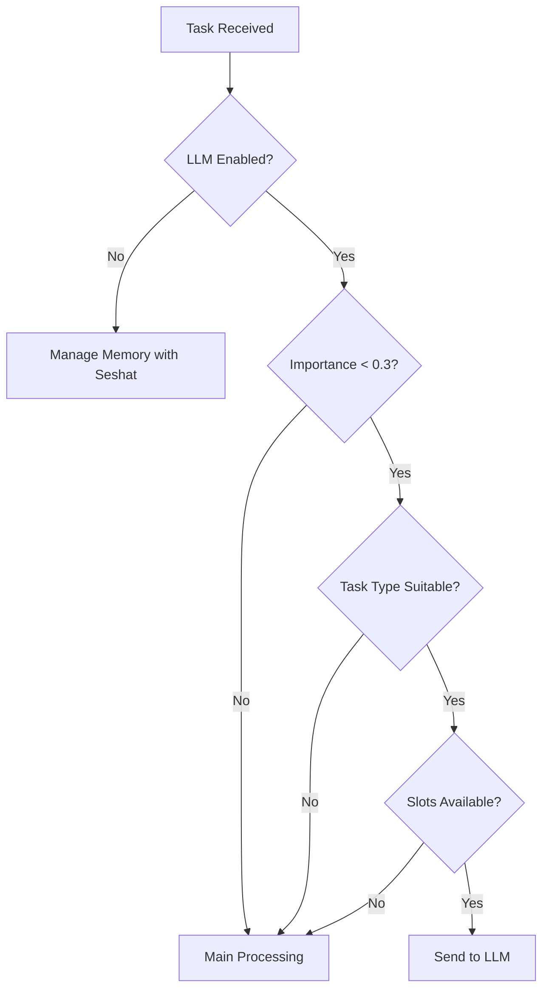

# Trinitas v4.0 - Memory & Learning Focused MCP Server

## 🎯 Overview

Trinitas v4.0 is a memory and learning-focused implementation of the five-persona AI system. This version shifts from direct execution to intelligent memory management and pattern learning.

## 🌟 Key Features

### Memory-Focused Architecture
- **Hybrid Backend Support**: Redis (fast), ChromaDB (semantic), SQLite (persistent)
- **Intelligent Caching**: Predictive memory preloading
- **Pattern Recognition**: Learns from execution history

### Bellona's Dual Role
- **With Local LLM**: Distributes low-importance tasks (< 0.3) to LLM
- **Without LLM (Default)**: Manages memory optimization with Seshat

### Seshat's Monitoring
- Tracks memory usage patterns
- Identifies optimization opportunities
- Generates usage reports and insights

## 📦 Installation

```bash
# Quick install
./install_v4.sh

# Manual install
python3 -m venv .venv
source .venv/bin/activate
pip install -r requirements.txt
```

## ⚙️ Configuration

Edit `config/.env`:

```bash
# Core Mode
TRINITAS_MODE=memory_focused

# Memory Backend (hybrid, redis, sqlite)
MEMORY_BACKEND=hybrid

# Local LLM (Default: OFF)
LOCAL_LLM_ENABLED=false
LOCAL_LLM_ENDPOINT=http://192.168.99.102:1234/v1/

# Task Distribution
LLM_PRIORITY_THRESHOLD=0.3
```

## 🚀 Usage

### Start MCP Server
```bash
python3 src/mcp_server_v4.py
```

### Available MCP Tools

```python
# Store memory
mcp__trinitas-mcp__memory_store(
    key="project_info",
    value={"data": "..."},
    persona="athena",
    importance=0.8
)

# Recall memory
mcp__trinitas-mcp__memory_recall(
    query="project",
    semantic=True,
    limit=10
)

# Execute with memory context
mcp__trinitas-mcp__execute_with_memory(
    persona="artemis",
    task="Optimize algorithm",
    use_llm=False  # Optional override
)

# Apply learned patterns
mcp__trinitas-mcp__learning_apply(
    pattern="optimization_pattern_1",
    task="New optimization task"
)

# Get system status
mcp__trinitas-mcp__get_status(
    component="all"  # or: bellona, seshat, memory, learning
)
```

## 🧪 Testing

```bash
# Run full test suite
python3 test_v4.py

# Expected output:
# ✅ Passed: 8/8 (100.0%)
# 🎉 All tests passed! Trinitas v4.0 is ready.
```

## 📊 Architecture

```
trinitas-mcp-v4/
├── src/
│   ├── mcp_server_v4.py       # Main MCP server
│   ├── memory_manager_v4.py   # Enhanced memory manager
│   ├── learning_system.py     # Pattern recognition & learning
│   ├── bellona_distributor.py # Task distribution logic
│   └── seshat_monitor.py      # Memory usage monitoring
├── config/
│   └── .env                   # Configuration
├── learning_data/             # Learning system storage
├── chromadb_data/            # Vector database
└── sqlite_data.db            # Persistent storage
```

## 🔄 Bellona's Decision Flow



## 📈 Memory Sections

1. **working_memory**: Short-term, fast access
2. **episodic_memory**: Event-based memories
3. **semantic_memory**: Knowledge and facts
4. **procedural_memory**: How-to knowledge
5. **cache**: Temporary cache
6. **learning_data**: Learning system data
7. **pattern_storage**: Identified patterns
8. **performance_metrics**: Performance data

## 🎯 Task Priority Levels

- **CRITICAL (0.9)**: Main processing required
- **HIGH (0.7)**: Main processing recommended
- **MEDIUM (0.5)**: Decision-based routing
- **LOW (0.3)**: LLM processing possible
- **TRIVIAL (0.1)**: LLM processing recommended

## 🔍 Monitoring & Optimization

Seshat continuously monitors:
- Memory access patterns
- Performance bottlenecks
- Cache hit rates
- Unused memory ratios

Generates recommendations for:
- Cache expansion
- Index optimization
- Memory cleanup
- Pattern consolidation

## 📝 Version History

- **v4.0**: Memory-focused architecture with learning system
- **v3.5**: Direct execution with MCP tools
- **v3.0**: Initial five-persona system

---

*Trinitas v4.0 - Memory, Learning, Intelligence*