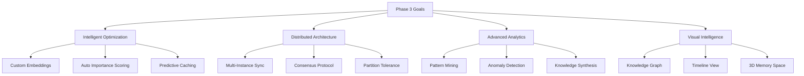

# Trinitas v3.5 Phase 3 - Advanced Memory Features
## 次世代記憶システムの実装計画

### Executive Summary

フェーズ3では、Trinitasの記憶システムを**適応的**、**分散的**、**知的**なシステムへと進化させます。AIによる自動最適化、マルチインスタンス同期、高度な可視化を実現します。

## 1. Phase 3 Overview

### 1.1 Core Objectives



### 1.2 Implementation Timeline

| Week | Focus Area | Deliverables |
|------|------------|--------------|
| 1-2 | Custom Embeddings | Persona-specific models |
| 3-4 | Distributed Memory | Multi-instance sync |
| 5-6 | AI Management | Auto-optimization |
| 7-8 | Visualization | Interactive dashboards |

## 2. Custom Embedding Models

### 2.1 Persona-Specific Embeddings

```python
class PersonaEmbeddingModel:
    """ペルソナ特化型エンベディングモデル"""
    
    def __init__(self, persona: str):
        self.persona = persona
        self.base_model = self._load_base_model()
        self.fine_tuned_model = None
        self.vocabulary = self._build_persona_vocabulary()
        
    def _build_persona_vocabulary(self) -> Dict[str, float]:
        """ペルソナ固有の語彙と重み"""
        vocabularies = {
            "athena": {
                "architecture": 1.5,
                "system": 1.3,
                "design": 1.4,
                "scalability": 1.2,
                "microservices": 1.5,
                "api": 1.3,
                "integration": 1.2
            },
            "artemis": {
                "optimization": 1.5,
                "performance": 1.4,
                "algorithm": 1.3,
                "complexity": 1.2,
                "efficiency": 1.5,
                "benchmark": 1.3,
                "profiling": 1.2
            },
            "hestia": {
                "security": 1.5,
                "vulnerability": 1.4,
                "encryption": 1.3,
                "authentication": 1.3,
                "threat": 1.4,
                "compliance": 1.2,
                "audit": 1.3
            }
        }
        return vocabularies.get(self.persona, {})
    
    async def fine_tune(self, training_data: List[MemoryItem]):
        """ペルソナの記憶でファインチューニング"""
        # Extract domain-specific patterns
        patterns = self._extract_patterns(training_data)
        
        # Adjust embedding weights
        self.fine_tuned_model = self._adjust_model(patterns)
        
        logger.info(f"Fine-tuned embedding model for {self.persona}")
    
    def encode(self, text: str) -> np.ndarray:
        """テキストをペルソナ特化エンベディングに変換"""
        # Base embedding
        base_embedding = self.base_model.encode(text)
        
        # Apply persona-specific adjustments
        for word, weight in self.vocabulary.items():
            if word in text.lower():
                base_embedding *= weight
        
        # Normalize
        return base_embedding / np.linalg.norm(base_embedding)
```

### 2.2 Adaptive Embedding Updates

```python
class AdaptiveEmbeddingSystem:
    """適応的エンベディング更新システム"""
    
    def __init__(self):
        self.models = {}
        self.performance_metrics = {}
        self.update_threshold = 0.8
        
    async def evaluate_performance(self, persona: str) -> float:
        """検索精度を評価"""
        test_queries = self._generate_test_queries(persona)
        correct_results = 0
        
        for query, expected_ids in test_queries:
            results = await self.search(query, persona)
            if self._validate_results(results, expected_ids):
                correct_results += 1
        
        return correct_results / len(test_queries)
    
    async def auto_retrain(self):
        """パフォーマンスに基づいて自動再訓練"""
        for persona, model in self.models.items():
            performance = await self.evaluate_performance(persona)
            
            if performance < self.update_threshold:
                logger.info(f"Retraining {persona} model (performance: {performance:.2%})")
                
                # Get recent memories
                recent_memories = await self.get_recent_memories(persona, days=30)
                
                # Retrain model
                await model.fine_tune(recent_memories)
                
                # Update model
                self.models[persona] = model
```

## 3. Distributed Memory System

### 3.1 Multi-Instance Architecture

```python
class DistributedMemoryNode:
    """分散メモリノード"""
    
    def __init__(self, node_id: str, peers: List[str]):
        self.node_id = node_id
        self.peers = peers
        self.local_memory = HybridMemoryBackend()
        self.sync_queue = asyncio.Queue()
        self.vector_clock = VectorClock(node_id)
        
    async def write(self, item: MemoryItem) -> bool:
        """分散書き込み"""
        # Local write
        item.metadata['node_id'] = self.node_id
        item.metadata['vector_clock'] = self.vector_clock.increment()
        
        success = await self.local_memory.store(item)
        
        # Replicate to peers
        if success:
            await self._replicate_to_peers(item)
        
        return success
    
    async def _replicate_to_peers(self, item: MemoryItem):
        """ピアノードへレプリケーション"""
        replication_tasks = []
        
        for peer in self.peers:
            task = self._send_to_peer(peer, item)
            replication_tasks.append(task)
        
        # Wait for majority
        results = await asyncio.gather(*replication_tasks, return_exceptions=True)
        successful = sum(1 for r in results if r is True)
        
        if successful < len(self.peers) // 2 + 1:
            logger.warning(f"Replication achieved only {successful}/{len(self.peers)} nodes")
    
    async def handle_conflict(self, local: MemoryItem, remote: MemoryItem) -> MemoryItem:
        """競合解決"""
        # Use vector clock for ordering
        if self.vector_clock.compare(
            local.metadata['vector_clock'],
            remote.metadata['vector_clock']
        ) == 'concurrent':
            # Concurrent updates - merge
            return self._merge_memories(local, remote)
        else:
            # Use later update
            return remote if remote.timestamp > local.timestamp else local
```

### 3.2 Consensus Protocol

```python
class MemoryConsensus:
    """メモリ同期のためのコンセンサスプロトコル"""
    
    def __init__(self, nodes: List[DistributedMemoryNode]):
        self.nodes = nodes
        self.consensus_type = "raft"  # or "paxos"
        self.leader = None
        self.term = 0
        
    async def elect_leader(self):
        """リーダー選出"""
        candidates = []
        
        for node in self.nodes:
            if await node.is_healthy():
                candidates.append(node)
        
        if not candidates:
            raise Exception("No healthy nodes available")
        
        # Simple election: node with most recent data
        leader = max(candidates, key=lambda n: n.last_update_time)
        self.leader = leader
        self.term += 1
        
        logger.info(f"Elected leader: {leader.node_id} (term: {self.term})")
    
    async def replicate_write(self, item: MemoryItem) -> bool:
        """リーダーを通じた書き込み"""
        if not self.leader:
            await self.elect_leader()
        
        # Leader writes first
        success = await self.leader.write(item)
        
        if not success:
            return False
        
        # Replicate to followers
        replication_count = 0
        for node in self.nodes:
            if node != self.leader:
                if await node.replicate_from_leader(item):
                    replication_count += 1
        
        # Require majority
        return replication_count >= len(self.nodes) // 2
```

## 4. AI-Driven Memory Management

### 4.1 Automatic Importance Scoring

```python
class ImportanceScorer:
    """AI駆動の重要度スコアリング"""
    
    def __init__(self):
        self.feature_extractors = [
            self._extract_uniqueness,
            self._extract_recency,
            self._extract_frequency,
            self._extract_semantic_richness,
            self._extract_connectivity
        ]
        self.model = self._load_scoring_model()
    
    async def score(self, item: MemoryItem, context: MemoryContext) -> float:
        """記憶の重要度を自動スコアリング"""
        features = []
        
        # Extract features
        for extractor in self.feature_extractors:
            feature = await extractor(item, context)
            features.append(feature)
        
        # Predict importance
        importance = self.model.predict([features])[0]
        
        # Apply persona-specific adjustments
        importance = self._adjust_for_persona(importance, item.persona)
        
        return min(max(importance, 0.0), 1.0)
    
    async def _extract_uniqueness(self, item: MemoryItem, context: MemoryContext) -> float:
        """ユニークさを評価"""
        similar = await context.find_similar(item.content, threshold=0.9)
        return 1.0 - (len(similar) / 100)  # Less similar = more unique
    
    async def _extract_connectivity(self, item: MemoryItem, context: MemoryContext) -> float:
        """他の記憶との関連性"""
        connections = await context.find_connections(item)
        return min(len(connections) / 10, 1.0)  # More connections = higher score
```

### 4.2 Predictive Caching

```python
class PredictiveCache:
    """予測的キャッシング"""
    
    def __init__(self):
        self.access_patterns = {}
        self.prediction_model = self._load_lstm_model()
        self.cache_size = 1000
        
    async def predict_next_access(self, current_query: str) -> List[str]:
        """次にアクセスされる記憶を予測"""
        # Get access history
        history = self.access_patterns.get(current_query, [])
        
        if len(history) < 5:
            return []  # Not enough data
        
        # Prepare sequence
        sequence = self._prepare_sequence(history[-10:])
        
        # Predict next accesses
        predictions = self.prediction_model.predict(sequence)
        
        # Get top predicted memory IDs
        top_predictions = self._get_top_predictions(predictions, k=5)
        
        return top_predictions
    
    async def preload_cache(self, query: str):
        """予測に基づいてキャッシュをプリロード"""
        predicted_ids = await self.predict_next_access(query)
        
        for memory_id in predicted_ids:
            if not self._is_cached(memory_id):
                memory = await self.backend.retrieve(memory_id)
                if memory:
                    await self.cache.set(memory_id, memory, ttl=300)
        
        logger.debug(f"Preloaded {len(predicted_ids)} predicted memories")
```

### 4.3 Anomaly Detection

```python
class MemoryAnomalyDetector:
    """記憶の異常検知"""
    
    def __init__(self):
        self.isolation_forest = IsolationForest(contamination=0.1)
        self.threshold = 0.05
        
    async def detect_anomalies(self, persona: str) -> List[AnomalyReport]:
        """異常な記憶パターンを検出"""
        memories = await self.get_recent_memories(persona, days=7)
        
        if len(memories) < 10:
            return []
        
        # Extract features
        features = self._extract_features(memories)
        
        # Detect anomalies
        predictions = self.isolation_forest.predict(features)
        
        anomalies = []
        for i, pred in enumerate(predictions):
            if pred == -1:  # Anomaly
                anomaly = AnomalyReport(
                    memory=memories[i],
                    score=self.isolation_forest.score_samples([features[i]])[0],
                    reason=self._analyze_anomaly(memories[i], features[i])
                )
                anomalies.append(anomaly)
        
        return anomalies
    
    def _analyze_anomaly(self, memory: MemoryItem, features: np.ndarray) -> str:
        """異常の理由を分析"""
        reasons = []
        
        # Check unusual patterns
        if features[0] > 2:  # Length anomaly
            reasons.append("Unusually long content")
        if features[1] < -2:  # Importance anomaly
            reasons.append("Abnormal importance score")
        if features[2] > 3:  # Access pattern anomaly
            reasons.append("Unusual access pattern")
        
        return ", ".join(reasons) if reasons else "Unknown anomaly"
```

## 5. Memory Visualization Tools

### 5.1 Knowledge Graph Visualization

```python
class KnowledgeGraphBuilder:
    """知識グラフ構築"""
    
    def __init__(self):
        self.graph = nx.DiGraph()
        self.layout_engine = "force_directed"
        
    async def build_graph(self, memories: List[MemoryItem]) -> nx.DiGraph:
        """記憶から知識グラフを構築"""
        # Add nodes
        for memory in memories:
            self.graph.add_node(
                memory.id,
                label=self._extract_label(memory),
                type=memory.type.value,
                persona=memory.persona,
                importance=memory.importance,
                timestamp=memory.timestamp.isoformat()
            )
        
        # Add edges based on relationships
        for i, mem1 in enumerate(memories):
            for mem2 in memories[i+1:]:
                similarity = self._calculate_similarity(mem1, mem2)
                if similarity > 0.5:
                    self.graph.add_edge(
                        mem1.id,
                        mem2.id,
                        weight=similarity,
                        type="similar"
                    )
        
        # Detect communities
        communities = nx.community.louvain_communities(self.graph)
        for i, community in enumerate(communities):
            for node in community:
                self.graph.nodes[node]['community'] = i
        
        return self.graph
    
    def export_to_cytoscape(self) -> Dict:
        """Cytoscape.js形式でエクスポート"""
        elements = {
            "nodes": [],
            "edges": []
        }
        
        for node, data in self.graph.nodes(data=True):
            elements["nodes"].append({
                "data": {
                    "id": node,
                    "label": data.get("label", ""),
                    "persona": data.get("persona", ""),
                    "importance": data.get("importance", 0.5)
                },
                "position": self._get_position(node)
            })
        
        for source, target, data in self.graph.edges(data=True):
            elements["edges"].append({
                "data": {
                    "source": source,
                    "target": target,
                    "weight": data.get("weight", 1.0)
                }
            })
        
        return elements
```

### 5.2 Timeline Visualization

```python
class MemoryTimeline:
    """記憶のタイムライン可視化"""
    
    def __init__(self):
        self.timeline_data = []
        
    async def generate_timeline(self, 
                               persona: str,
                               start_date: datetime,
                               end_date: datetime) -> List[TimelineEvent]:
        """タイムラインデータを生成"""
        memories = await self.get_memories_in_range(
            persona, start_date, end_date
        )
        
        events = []
        for memory in memories:
            event = TimelineEvent(
                timestamp=memory.timestamp,
                title=self._generate_title(memory),
                description=self._summarize_content(memory),
                type=memory.type.value,
                importance=memory.importance,
                tags=memory.tags
            )
            events.append(event)
        
        # Group by time periods
        grouped = self._group_by_period(events)
        
        return grouped
    
    def export_to_vis_timeline(self) -> str:
        """vis-timeline形式でエクスポート"""
        items = []
        
        for event in self.timeline_data:
            items.append({
                "id": event.id,
                "content": event.title,
                "start": event.timestamp.isoformat(),
                "type": "point" if event.duration == 0 else "range",
                "className": f"importance-{int(event.importance * 10)}",
                "title": event.description  # Tooltip
            })
        
        return json.dumps(items)
```

### 5.3 3D Memory Space

```python
class Memory3DSpace:
    """3次元記憶空間の可視化"""
    
    def __init__(self):
        self.embeddings = {}
        self.reducer = UMAP(n_components=3)
        
    async def create_3d_space(self, memories: List[MemoryItem]) -> np.ndarray:
        """記憶を3D空間にマッピング"""
        # Get embeddings
        embeddings = []
        for memory in memories:
            if memory.id not in self.embeddings:
                embedding = await self.get_embedding(memory.content)
                self.embeddings[memory.id] = embedding
            embeddings.append(self.embeddings[memory.id])
        
        # Reduce to 3D
        embeddings_array = np.array(embeddings)
        coords_3d = self.reducer.fit_transform(embeddings_array)
        
        return coords_3d
    
    def export_to_threejs(self, memories: List[MemoryItem], coords: np.ndarray) -> Dict:
        """Three.js形式でエクスポート"""
        points = []
        
        for i, memory in enumerate(memories):
            point = {
                "position": {
                    "x": float(coords[i, 0]),
                    "y": float(coords[i, 1]),
                    "z": float(coords[i, 2])
                },
                "color": self._get_color_for_persona(memory.persona),
                "size": memory.importance * 10,
                "data": {
                    "id": memory.id,
                    "content": str(memory.content)[:100],
                    "type": memory.type.value,
                    "persona": memory.persona
                }
            }
            points.append(point)
        
        return {
            "points": points,
            "camera": {
                "position": {"x": 50, "y": 50, "z": 50},
                "lookAt": {"x": 0, "y": 0, "z": 0}
            }
        }
```

## 6. Implementation Roadmap

### 6.1 Week 1-2: Custom Embeddings

```bash
- [ ] Implement PersonaEmbeddingModel
- [ ] Create fine-tuning pipeline
- [ ] Benchmark embedding quality
- [ ] Deploy persona-specific models
```

### 6.2 Week 3-4: Distributed Architecture

```bash
- [ ] Implement DistributedMemoryNode
- [ ] Create consensus protocol
- [ ] Test multi-instance sync
- [ ] Handle network partitions
```

### 6.3 Week 5-6: AI Management

```bash
- [ ] Build ImportanceScorer
- [ ] Implement PredictiveCache
- [ ] Create AnomalyDetector
- [ ] Test auto-optimization
```

### 6.4 Week 7-8: Visualization

```bash
- [ ] Create KnowledgeGraphBuilder
- [ ] Implement MemoryTimeline
- [ ] Build 3D visualization
- [ ] Create interactive dashboard
```

## 7. Performance Targets

| Metric | Phase 2 | Phase 3 Target | Improvement |
|--------|---------|----------------|-------------|
| Embedding Quality | 0.85 | 0.95 | +12% |
| Search Relevance | 85% | 95% | +12% |
| Cache Hit Rate | 80% | 95% | +19% |
| Sync Latency | N/A | <100ms | New |
| Anomaly Detection | N/A | 98% accuracy | New |
| Visualization FPS | N/A | 60 FPS | New |

## 8. Risk Management

| Risk | Probability | Impact | Mitigation |
|------|------------|--------|------------|
| Model overfitting | Medium | High | Regular validation, cross-validation |
| Network partition | Low | High | Consensus protocol, eventual consistency |
| Performance degradation | Medium | Medium | Progressive rollout, A/B testing |
| Visualization lag | Low | Low | WebGL optimization, LOD techniques |

## 9. Success Metrics

### 9.1 Technical KPIs
- Embedding model accuracy: >95%
- Distributed sync success rate: >99.9%
- Anomaly detection precision: >90%
- Visualization render time: <16ms

### 9.2 Business KPIs
- Developer productivity: +30%
- Debug time reduction: -60%
- Knowledge discovery rate: +200%
- User satisfaction: >4.5/5

## 10. Conclusion

Phase 3 transforms Trinitas from a memory system into an **Intelligent Knowledge Partner** that:
- **Learns** from every interaction
- **Predicts** future needs
- **Discovers** hidden patterns
- **Visualizes** complex relationships

This positions Trinitas as not just an assistant, but a true **cognitive augmentation system** for software development teams.

---
*Trinitas v3.5 Phase 3 - Beyond Memory, Towards Intelligence*