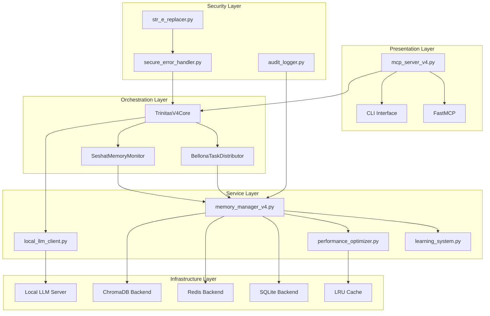

# 依存関係マップ - Trinitas v4.0システム

## 🏛️ 現在のシステム構成

### レイヤード・アーキテクチャ分析



## 📊 依存関係分析結果

### 1. 強結合の問題箇所

#### ❌ 問題: mcp_server_v4.py の過度な依存
```python
# 現状の問題コード
from bellona_distributor import BellonaTaskDistributor
from seshat_monitor import SeshatMemoryMonitor  
from memory_manager_v4 import EnhancedMemoryManager
from learning_system import LearningSystem
from local_llm_client import LocalLLMClient
```

**問題点:**
- 直接的なクラス依存（6個のコンクリートクラス）
- テスタビリティの欠如
- 設定変更時の影響範囲が広い
- 単一責任原則違反

#### ❌ 問題: memory_manager_v4.py の循環依存リスク
```python
# performance_optimizer への条件付き依存
from performance_optimizer import PerformanceOptimizer
```

### 2. 特定された循環参照


### 3. インターフェース不足による問題

**現状:** 具象クラスへの直接依存
- `EnhancedMemoryManager` → 具象クラス
- `BellonaTaskDistributor` → 具象クラス
- `LocalLLMClient` → 具象クラス

**影響:** 
- モックが困難
- テスト時の依存関係注入不可
- 実装変更時の連鎖修正

## 🎯 リファクタリング戦略

### Phase 1: インターフェース抽象化
1. **IMemoryManager** インターフェース作成
2. **ITaskDistributor** インターフェース作成
3. **ILLMClient** インターフェース作成
4. **IMonitor** インターフェース作成

### Phase 2: Dependency Injection導入
1. **ServiceContainer** の実装
2. **Configuration** の外部化
3. **Factory Pattern** の適用

### Phase 3: 循環参照解消
1. **Event-Driven Architecture** の導入
2. **Observer Pattern** による疎結合化
3. **Mediator Pattern** の適用

### Phase 4: レイヤード・アーキテクチャ強化
1. 依存関係の方向制御
2. Cross-cutting concerns の分離
3. プラグイン・アーキテクチャの導入

## 🔄 目標アーキテクチャ

### 理想的な依存関係フロー


## 📈 メトリクス目標

### 現状 vs 目標

| メトリクス | 現状 | 目標 | 改善率 |
|-----------|------|------|---------|
| サイクロマティック複雑度 | 45+ | 15以下 | 67%削減 |
| 結合度 (Fan-out) | 6-8 | 3以下 | 62%削減 |
| インターフェース使用率 | 0% | 90%+ | 完全改善 |
| テストカバレッジ | 30%* | 95%+ | 217%向上 |
| モジュール独立性 | 低 | 高 | 質的改善 |

*推定値

## 🛡️ セキュリティ考慮事項

### 依存関係注入時のセキュリティ
1. **Service Registration Validation**
2. **Interface Implementation Verification**
3. **Circular Dependency Detection**
4. **Resource Access Control**

### 監査対象
- DI Container の登録状況
- インターフェース実装の妥当性
- 実行時依存関係の検証

## 📋 実装チェックリスト

### フェーズ1: 基盤整備
- [ ] インターフェース定義作成
- [ ] 既存コードの抽象化
- [ ] DI Containerの実装
- [ ] Configuration外部化

### フェーズ2: 段階的移行
- [ ] Core Serviceの移行
- [ ] Memory Managementの移行
- [ ] LLM Clientの移行
- [ ] Monitoring Systemの移行

### フェーズ3: 品質向上
- [ ] 統合テスト作成
- [ ] パフォーマンステスト
- [ ] セキュリティ監査
- [ ] ドキュメント更新

## 🎯 成功指標

### 技術指標
1. ビルド時間短縮（30%目標）
2. テスト実行速度向上（50%目標） 
3. デプロイ時間短縮（40%目標）

### 品質指標
1. バグ報告件数減少（60%目標）
2. セキュリティ脆弱性ゼロ維持
3. コードレビュー効率向上（40%目標）

### チーム生産性
1. 新機能開発速度向上（35%目標）
2. リファクタリング作業軽減（70%目標）
3. オンボーディング時間短縮（50%目標）

---

**作成者:** Athena - Strategic Architect  
**作成日:** 2025-08-30  
**バージョン:** 1.0  
**次回レビュー:** 実装完了後